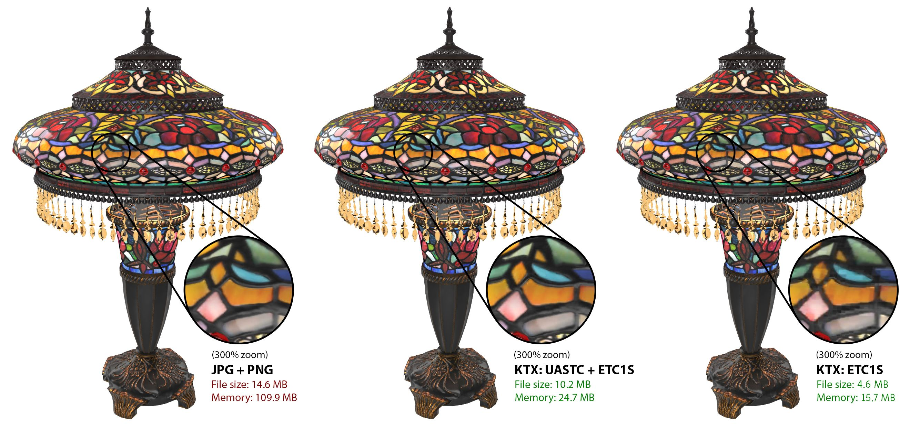
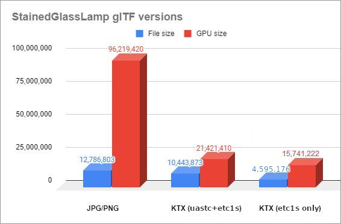
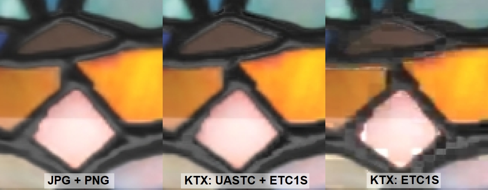
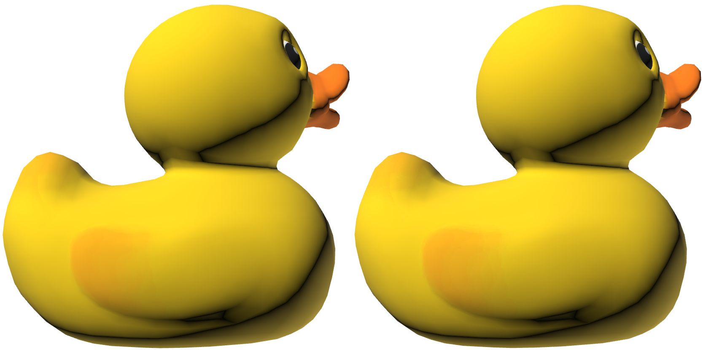
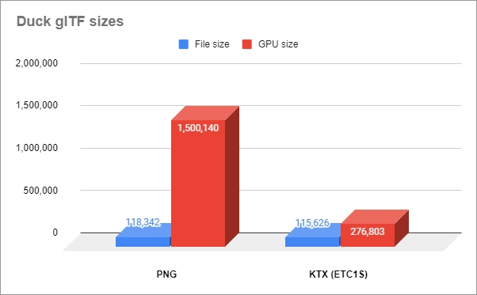

# KTX 艺术家指南


艺术家和内容创作者如何使用带有 [Basis Universal 纹理压缩](https://github.com/KhronosGroup/KTX-Software#readme) 的 [KTX 纹理容器](https://registry.khronos.org/KTX/specs/2.0/ktxspec.v2.html) 为 [glTF](https://www.khronos.org/gltf/) 压缩纹理。

KTX 在内存中保持压缩状态。这在 glTF 纹理格式中是独一无二的。所有纹理都必须加载到 GPU 内存中进行渲染，但大多数文件在渲染前都必须完全解压缩。KTX 被压缩为机器友好的通用格式，并在加载时自动转换为适合各种硬件设备的最佳格式。





KTX 最适用于加载时间必须较快且最需要节省内存的情况。在房间规划器、游戏关卡和产品配置器等多资产场景中，通常会出现这种情况。

在创建用于单个模型显示的资产时，可能更倾向于减少文件大小，而不关心内存大小。在这种情况下，另一种纹理格式可能是更好的选择，例如 WEBP 或 JPEG，它们可以提供非常小的文件大小，但在加载到 GPU 时会完全不压缩。

## KTX 压缩指南

具有图形用户界面的艺术家友好型 KTX 软件指南：

* [KTX Guide for Gestaltor](subpages/KTXArtistGuide_Gestaltor.cn.md) 是一款支持 KTX 的可视化 glTF 编辑器。可用于编辑单个 glTF 文件，或通过命令行进行批处理。2MB 以下的 glTF 文件可免费用于非商业用途。订阅后将取消所有限制，并可访问命令行。
* [KTX Guide for glTF-Compressor](subpages/KTXArtistGuide_glTF-Compressor.cn.md) 是一款支持 KTX 的网络 3D 查看器。可用于压缩单个 glTF 文件，也可保存设置以便在其他地方批量处理。可免费用于无限量的 glTF 文件。
* [KTX Guide for RapidCompact](subpages/KTXArtistGuide_RapidCompact.cn.md) 是一个在线平台，用于优化支持 KTX 的 3D 数据。可用于编辑单个 glTF 文件，或通过命令行进行批处理。非商业用途免费，每月最多可进行 20 次转换。订阅可取消所有限制，并可访问命令行。

还有其他 KTX 工具可供选择，它们可能对艺术家不那么友好，但往往能提供最大的灵活性和控制性：
* [KTX Guide for glTF-Transform](subpages/KTXArtistGuide_glTF-Transform.cn.md) 是用于 glTF 编辑的命令行工具，包括 KTX 压缩。
* [KTX Guide for toktx](subpages/KTXArtistGuide_toktx.cn.md) 是用于 KTX 压缩纹理的命令行工具。
* [KTX 2.0 Tools](KTXTools.md) 列出了更多 KTX 工具。

## 为什么使用 KTX?

glTF 文件中的纹理可以使用 Basis Universal 压缩技术压缩成 .ktx2 GPU 纹理，与 JPEG 或 PNG 或 WEBP 纹理相比，KTX 可提供更快的 GPU 上传速度和更少的 GPU 内存消耗。这些格式在加载到 GPU 内存时是完全未压缩的，而 KTX 则在 GPU 上保持压缩。

制作压缩的 GPU 纹理通常需要更仔细的调整以保持图像质量，但对于需要在上传图像时保持流畅帧速率或 GPU 内存有限的应用程序来说，这种额外的努力是值得的。在某些情况下，压缩纹理的文件大小也可能小于 PNG 或 JPEG 纹理，但这并不能保证。如果性能很重要，压缩 GPU 纹理的好处可能会超过文件大小的增加。

有两种基础通用压缩方法：ETC1S 和 UASTC。

ETC1S 可提供更高的压缩率，在处理大面积纯色或大部分单色值时效果更好；但在处理复杂纹理或饱和色区域相邻的纹理时，效果并不理想。当纹理变化不是很重要时，ETC1S 就会派上用场。它尤其适用于非 PBR 纹理，例如卡通渲染或界面资产。

UASTC 可为高对比度、高细节的彩色纹理提供更高的视觉质量。它能更好地处理 RGB 通道数值差异很大的 "包装 "纹理，包括遮蔽/粗糙度/金属度（ORM）、法线和 [glTF 扩展](https://github.com/KhronosGroup/glTF/tree/master/extensions)使用的纹理，如 KHR_materials_clearcoat，该纹理的红色通道用于 clearcoatTexture，绿色通道用于 clearcoatRoughnessTexture。

## glTF 纹理格式

glTF 支持四种纹理格式。每种格式都有不同的功能，请根据任务选择合适的格式。

1. JPEG
    * `一般准则：文件小，兼容性强。下载速度快，但加载时间慢。占用大量内存，不支持 alpha。`
    * 不会在内存中保持压缩。
    * 兼容性强。
    * 文件尺寸小。
    * 图像质量好。有损压缩，可能有噪音。 
    * 不支持 alpha。<br/>
1. PNG
    * `一般准则：用于获得最高的图像质量、广泛的兼容性和 alpha 通道。加载时间较慢，占用大量内存，文件大小可能较大。`
    * 不会在内存中保持压缩状态。
    * 兼容性强。
    * 文件大小可能会很大，除非主要是平面色彩。
    * 整体图像质量完美。无损压缩，但可使用调色板压缩。 
    * 支持 alpha。<br/>
1. KTX
    * `一般准则：使用它可获得最快的加载时间和最小的内存占用。下载速度可能较慢。` 
    * 在内存中保持压缩。
    * 渲染器必须支持 [KHR_texture_basisu](https://github.com/KhronosGroup/glTF/blob/main/extensions/2.0/Khronos/KHR_texture_basisu/README.md).
    * 文件大小与 JPEG 相似，但可能更大。
    * 图像质量好。有损压缩，可能是块状的。
    * 支持 alpha。<br/>
1. WEBP
    * `一般准则：使用最小文件大小和 alpha 通道。下载速度最快，但加载时间较慢，而且会占用大量内存。如果法线贴图噪音太大，请使用 JPEG 或 PNG 代替。` 
    * 不会在内存中保持压缩。
    * 渲染器必须支持 [EXT_texture_webp](https://github.com/KhronosGroup/glTF/blob/main/extensions/2.0/Vendor/EXT_texture_webp/README.md).
    * 文件大小通常最小，比 JPEG 小得多。
    * 图像质量好。有损压缩，可能会出现模糊和噪点。 
    * 支持 alpha。<br/>

## 压缩示例

### 彩色玻璃灯

这个来自 Wayfair 的[彩色玻璃灯模型](https://github.com/KhronosGroup/glTF-Sample-Assets/tree/main/Models/StainedGlassLamp) 使用了 JPG 和 PNG 纹理。整个文件大小约为 13 MB，但在 GPU 内存中却增加到 96 MB，因为必须对纹理进行解压缩才能用于渲染。

中间和右边的灯是用 KTX 压缩的。中间的灯使用了最高质量的压缩设置，伪影几乎无法察觉，但节省的内存却非常可观。使用 KTX 压缩纹理后，文件大小减少到 10 MB，在 GPU 内存中变成 21 MB，约为文件大小的 81%，仅为 GPU 大小的 22%！



> 📝 NOTE: 
> 可以通过这些现场演示对这些压缩进行交互式检查: 
>- JPG+PNG vs. high quality UASTC+ETC1S https://playground.babylonjs.com/full.html#YD2TXP#23
>- JPG+PNG vs. ETC1S only https://playground.babylonjs.com/full.html#YD2TXP#22 

最右边的灯只用 ETC1S 压缩，会产生明显的块压缩伪影。如果文件和 GPU 的大小比质量更重要，这也许是可以接受的。这说明了对压缩编解码器和设置进行微调的重要性；正如 UASTC+ETC1S 示例所示，通过实施更精细的压缩设置，这些伪影几乎可以消除，如下所示。

对于高质量的 UASTC+ETC1S 版本，纹理是使用 [toktx](https://github.com/KhronosGroup/KTX-Software#readme) ，通过偏向高质量的压缩设置组合，从 PNG 源文件中压缩出来的。打包纹理（ORM、法线等）使用 UASTC，基色和发射纹理使用 ETC1S，但根据分析结果也有例外...... `glass_basecolor-alpha` 和 `glass_emissive` 纹理从 ETC1S 更改为 UASTC，因为这些纹理在模型上显示得很明显，而且包含很多颜色变化。

```
set mipmap=--genmipmap
set uastc=--t2 --encode uastc --uastc_quality 4 --uastc_rdo_l .5 --uastc_rdo_d 65536 --zcmp 22
set uastchq=--t2 --encode uastc --uastc_quality 4 --uastc_rdo_l .25 --uastc_rdo_d 65536 --zcmp 22
set etc1s=--t2 --encode etc1s --clevel 4 --qlevel 255
toktx %mipmap% %etc1s% StainedGlassLamp_base_basecolor.ktx2 StainedGlassLamp_base_basecolor.png
toktx %mipmap% %etc1s% StainedGlassLamp_base_emissive.ktx2 StainedGlassLamp_base_emissive.png
toktx %mipmap% %uastc% StainedGlassLamp_glass_basecolor-alpha.ktx2 StainedGlassLamp_glass_basecolor-alpha.png
toktx %mipmap% %uastc% StainedGlassLamp_glass_emissive.ktx2 StainedGlassLamp_glass_emissive.png
toktx %mipmap% %etc1s% StainedGlassLamp_grill_basecolor-alpha.ktx2 StainedGlassLamp_grill_basecolor-alpha.png
toktx %mipmap% %etc1s% StainedGlassLamp_grill_emissive.ktx2 StainedGlassLamp_grill_emissive.png
toktx %mipmap% %etc1s% StainedGlassLamp_hardware_basecolor.ktx2 StainedGlassLamp_hardware_basecolor.png
toktx %mipmap% %etc1s% StainedGlassLamp_hardware_emissive.ktx2 StainedGlassLamp_hardware_emissive.png
toktx %mipmap% %uastchq% --assign_oetf linear --assign_primaries none StainedGlassLamp_base_normal.ktx2 StainedGlassLamp_base_normal.png
toktx %mipmap% %uastchq% --assign_oetf linear --assign_primaries none StainedGlassLamp_base_occlusion-rough-metal.ktx2 StainedGlassLamp_base_occlusion-rough-metal.png
toktx %mipmap% %uastc% --assign_oetf linear --assign_primaries none StainedGlassLamp_bulbs_occlusion-rough-metal.ktx2 StainedGlassLamp_bulbs_occlusion-rough-metal.png
toktx %mipmap% %uastchq% --assign_oetf linear --assign_primaries none StainedGlassLamp_glass_normal.ktx2 StainedGlassLamp_glass_normal.png
toktx %mipmap% %uastc% --assign_oetf linear --assign_primaries none StainedGlassLamp_glass_occlusion-rough-metal_transmission.ktx2 StainedGlassLamp_glass_occlusion-rough-metal_transmission.png
toktx %mipmap% %uastc% --assign_oetf linear --assign_primaries none StainedGlassLamp_glass_transmission-clearcoat.ktx2 StainedGlassLamp_glass_transmission-clearcoat.png
toktx %mipmap% %uastchq% --assign_oetf linear --assign_primaries none StainedGlassLamp_grill_normal.ktx2 StainedGlassLamp_grill_normal.png
toktx %mipmap% %uastc% --assign_oetf linear --assign_primaries none StainedGlassLamp_grill_occlusion-rough-metal.ktx2 StainedGlassLamp_grill_occlusion-rough-metal.png
toktx %mipmap% %uastchq% --assign_oetf linear --assign_primaries none StainedGlassLamp_hardware_normal.ktx2 StainedGlassLamp_hardware_normal.png
toktx %mipmap% %uastc% --assign_oetf linear --assign_primaries none StainedGlassLamp_hardware_occlusion-rough-metal.ktx2 StainedGlassLamp_hardware_occlusion-rough-metal.png
toktx %mipmap% %uastc% --assign_oetf linear --assign_primaries none StainedGlassLamp_steel_occlusion-rough-metal.ktx2 StainedGlassLamp_steel_occlusion-rough-metal.png
```


如上图所示，KTX 压缩大大改善了模型的 GPU 内存成本。

### Duck

索尼的 [Duck](https://github.com/KhronosGroup/glTF-Sample-Assets/tree/main/Models/Duck) 使用了单一的 512x512 PNG 纹理。它的颜色值大多为纯色，因此非常适合采用 ETC1S 压缩技术，因为它几乎不会产生块压缩伪影。它只节省了约 2% 的文件大小，但却节省了约 82% 的 GPU 内存。



左图：PNG 纹理，文件大小 118 KB，GPU 内存大小 1.5 MB。右图KTX 纹理，文件大小 116 KB，GPU 大小 277 KB。



鸭子纹理使用 glTF-Transform 命令压缩：

```
gltf-transform etc1s duck.gltf duck.gltf --verbose
```

## KTX 提示和技巧

* 在应用压缩之前，确保在实际场景中评估未压缩纹理的质量和性能；您可能根本不需要压缩！
* 使用数值而不是纹理。如果能使用数值代替纹理，就能减少一个需要压缩的纹理！例如，如果模型的基色是单一颜色，那么最好使用 baseColorFactor（四个数字）而不是 baseColorTexture（一个纹理文件）。
* 使用 8 位源文件。在压缩前，纹理应存储为每通道 8 位的 RGB 或 RGBA。
* 开始时使用未压缩的源文件。使用高质量源文件时，KTX 压缩将保留最佳的视觉质量。尽可能使用 PNG 格式的纹理。应避免使用 JPEG 纹理中的有损压缩，因为它可能会在最终结果中造成额外的伪影。KTX 会放大这些错误，导致更多的块状伪影或更模糊的效果。
* 对于 glTF 纹理，几乎总是需要二乘幂的尺寸：glTF-Transform有一个--power-of-two标志，可以帮你调整尺寸，但最好还是从预期尺寸开始。即使在支持非二进制幂纹理尺寸的较新平台上，纹理尺寸仍必须是 4 的倍数才能与 KHR_texture_basisu 配合使用。
* 纹理的分辨率应适合您的传输目标，通常不大于 2048x2048。有时，遮蔽/粗糙度/金属感（ORM）纹理的细节比基色纹理少，因此它的分辨率可以是基色纹理的 1/4......如果基色纹理是 1024x1024，ORM 可以是 512x512，但在模型上看起来仍然很好。
* 有时分辨率越高越好！在某些情况下，提高纹理的分辨率可能真的很有用，这样既能减少压缩伪影，又能保持较小的文件大小。要做到这一点，可以在压缩前将尺寸增加一倍（如从 512x512 增至 1024x1024），但不进行插值，然后比较结果。
* 在制作新纹理时，使用纹理扩张并尽量减少突出的 UV 接缝可获得最佳效果。
* 尽可能沿 4x4 像素网格对齐 UV。KTX 压缩方案以块为单位压缩图像，每个块都是 4x4 像素。当纹理中的平滑特征越过 4x4 边界时，可能会突然变得非常不平滑。如果能避免跨越这些 4x4 像素块，就能减少压缩痕迹。
* 每个颜色通道（R、G、B）的数值相差很大的纹理通常会比数值相近的纹理产生更多的伪影。例如，照片通常具有相似的数值，而法线贴图通常在不同通道之间有很大的差异。正因为如此，基于照片的纹理通常可以压缩得更多，而显示的伪影却更少。与其他纹理类型相比，可以考虑对闭塞/通透/金属度贴图或法线贴图使用不那么激进的压缩设置：您可能需要使用 UASTC 或 PNG（如果文件大小是个问题）。
* 较低 mips 的尺寸必须遵循通常的 mip 贴图规则--截断除以 2，但始终大于 0。例如，20x12 的基本级别将有以下 mip 级别：10x6、5x3、2x1、1x1。内容管道工具可以自行准备 mip 级别，也可以依靠 KTX 软件在压缩过程中创建缩放纹理。
* [3D Commerce Asset Creation Guidelines](https://github.com/KhronosGroup/3DC-Asset-Creation/blob/main/asset-creation-guidelines/RealtimeAssetCreationGuidelines.md)（《3D 商业资产创建指南》）中有关于如何创建格式良好的模型的重要信息。
