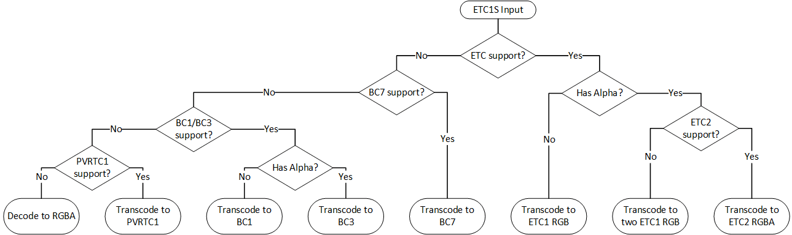
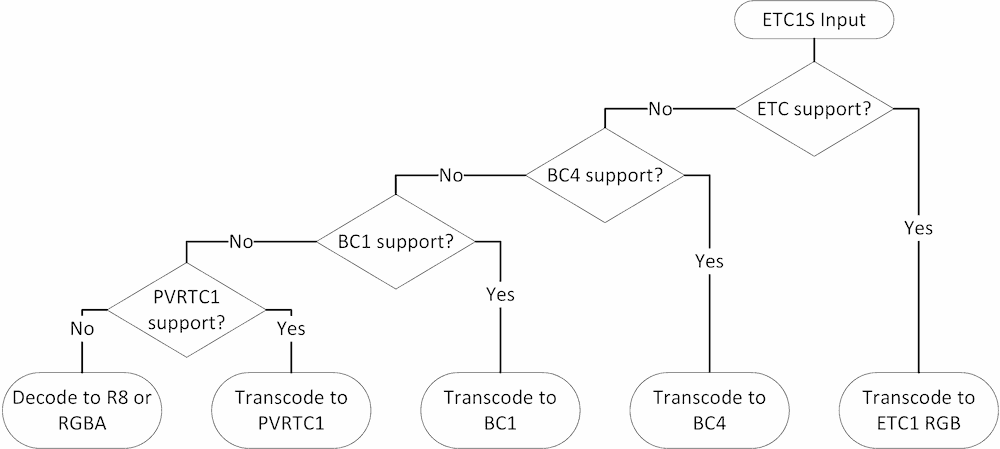
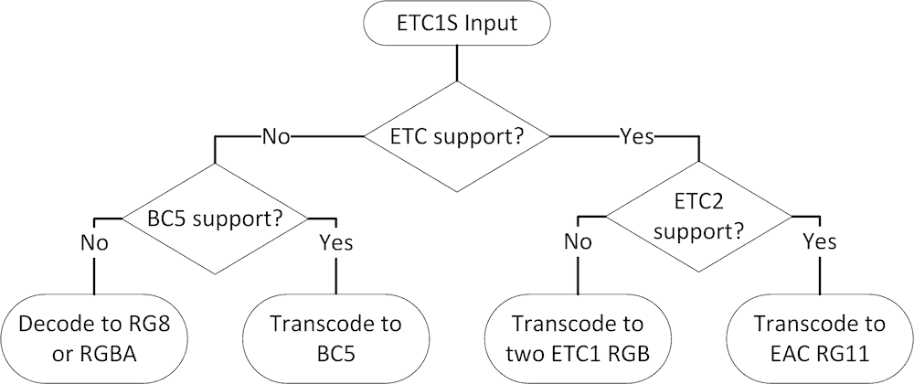
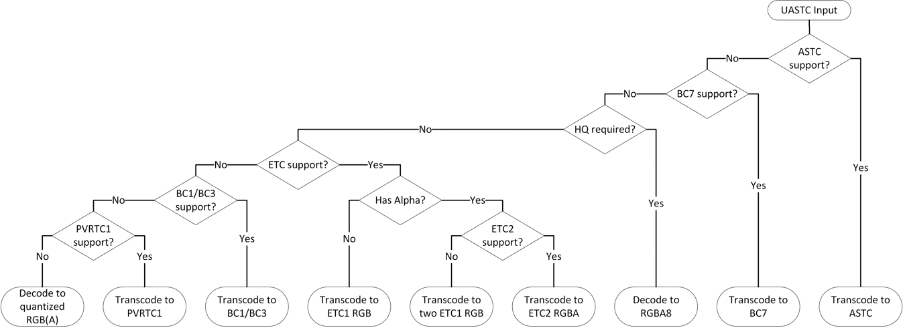
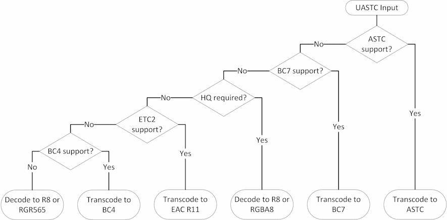
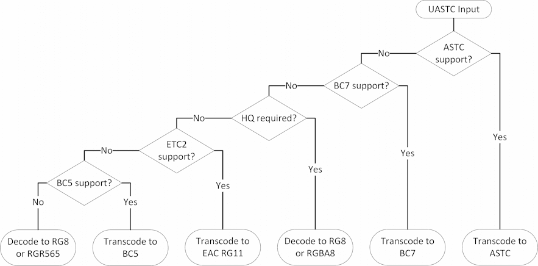

# KTX 2.0 / Basis Universal Textures — 开发者指南

## 目录

- [KTX容器格式 ( KTX Container Format )](#ktx容器格式)
- [基于块的压缩 ( Block-based Compression )](#基于块的压缩)
- [ETC1S / BasisLZ Codec](#etc1s--basislz-编解码器)
  - [概述](#概述)
  - [数据布局](#数据布局)
  - [运行时使用](#运行时使用)
  - [转码目标选择（RGB 和 RGBA）](#转码目标选择rgb-和-rgba)
  - [转码目标选择 (Red)](#转码目标选择-red)
  - [转码目标选择 (Red-Green)](#转码目标选择-red-green)
- [UASTC Codec](#uastc-编解码器)
  - [概述](#概述-1)
  - [数据布局](#数据布局-1)
  - [运行时使用](#运行时使用-1)
  - [主要转码目标](#主要转码目标)
  - [额外的转码目标 (RGB and RGBA)](#额外的转码目标-rgb-and-rgba)
  - [其他转码目标 (Red)](#其他转码目标-red)
  - [其他转码目标 (Red-Green)](#其他转码目标-red-green)
- [GPU API 支持](#gpu-api-支持)

## KTX容器格式

三种格式概念：

1. **容器格式：** 传输格式数据的解释性封装。描述图像尺寸、压缩类型，以及如何将数据访问和转码为 GPU 兼容的像素格式。如果没有容器格式，压缩数据就无法在软件应用程序之间正确移动。
  - _Examples: KTX 2.0_

2. **传输格式：** 一种高度压缩的像素数据表示，其布局设计用于非常高效地转码为一种或多种 GPU 压缩格式。
  - _Examples: ETC1S and UASTC_

3. **GPU 压缩像素格式：** GPU 可理解的像素数据压缩表示法。
  - _Examples: BCn, ASTC, ETC, and PVRTC1_

便携式[glTF 2.0](https://github.com/KhronosGroup/glTF)三维资产可使用存储在[KTX 2.0 容器格式](https://github.khronos.org/KTX-Specification/) (`.ktx2`)中的压缩纹理，正如[`KHR_texture_basisu`](https://github.com/KhronosGroup/glTF/tree/master/extensions/2.0/Khronos/KHR_texture_basisu) glTF 扩展所描述的那样。KTX 2.0 是一种相对简单的二进制数据格式，通过引用格式规范，无需使用现有软件即可读取或编写。现有几种实现方法可供使用：

- [KTX-Software](https://github.com/KhronosGroup/KTX-Software/)：用于读取、写入和转码 KTX 文件的官方 C/C++ 库，具有在各种图形应用程序接口中实例化纹理的可选功能。包括 [可下载的二进制包](https://github.com/KhronosGroup/KTX-Software/releases) 和 WebAssembly 构建。
- [Basis Universal](https://github.com/BinomialLLC/basis_universal/)：用于使用 BasisU 纹理格式编写和转码 KTX 文件的二项式 C/C++ 库。包括 WebAssembly 构建。
- [KTX-Parse](https://github.com/donmccurdy/KTX-Parse)：用于读写 KTX 文件的轻量级 JavaScript/TypeScript/Node.js 库。转码为 GPU 压缩格式必须单独处理<sup>1</sup>。

<small><sub><sup>1</sup>从 Basis 通用传输格式到 GPU 压缩格式的转码器包含在 [KTX 软件](https://github.com/KhronosGroup/KTX-Software/) 中，并可在 [Binomial C/C++/WASM 转码器](https://github.com/BinomialLLC/basis_universal/) 或 [Khronos Group WASM 转码器](https://github.com/KhronosGroup/Basis-Universal-Transcoders) 中独立使用。
</sub></small>

## 基于块的压缩

为了支持随机存取，压缩纹理通常以相同大小的块来组织。Basis Universal 总是使用 4×4 像素的块。

要计算给定纹理的块数（例如估算所需的 GPU 内存），应用程序应使用以下表达式：
```
WIDTH_IN_BLOCKS = (WIDTH_IN_PIXELS + 3) >> 2;
HEIGHT_IN_BLOCKS = (HEIGHT_IN_PIXELS + 3) >> 2;

BLOCK_COUNT = WIDTH_IN_BLOCKS * HEIGHT_IN_BLOCKS;
```

``` javascript
function calcMemory(width, height) {
  const WIDTH_IN_BLOCKS = (width + 3) >> 2;
  const HEIGHT_IN_BLOCKS = (height + 3) >> 2;
  return WIDTH_IN_BLOCKS * HEIGHT_IN_BLOCKS;
}
```

应用程序应预期基本 mip 层的尺寸为 1、2 或 4 的倍数。 不遵循此限制的输入无效，应予以拒绝。

后续 mip 层的尺寸遵循除以 2 的常规截断规则。For example,

| Mip Level | Width x Height, px | Width x Height, blocks |
|:-:|-:|-:|
| 0 | 100 x 200 | 25 x 50 |
| 1 | 50 x 100 | 13 x 25 |
| 2 | 25 x 50 | 7 x 13 |
| 3 | 12 x 25 | 3 x 7 |
| 4 | 6 x 12 | 2 x 3 |
| 5 | 3 x 6 | 1 x 2 |
| 6 | 1 x 3 | 1 x 1 |
| 7 | 1 x 1 | 1 x 1 |

在这里，基本 mip 级别完全填充了 `25 x 50` 压缩块。以下级别有一些填充，用于填充压缩块中未使用的像素。这些填充（如果存在）不会影响纹理坐标封装，也不会在采样过程中被访问。

某些旧平台（如 WebGL 1.0）可能会要求所有纹理的尺寸都是 2 的幂次方。在这种情况下，应用程序别无选择，只能对不具有 2 次幂尺寸的纹理进行解压缩和重新缩放，从而失去 GPU 纹理压缩的所有优势。

## ETC1S / BasisLZ 编解码器

### 概述

ETC1S / BasisLZ 是一种混合压缩方案，其特点是将重新排列的 ETC1S 纹理块数据与定制的 LZ 式无损压缩相结合。它通过优先处理 Luma 信息，实现了极高的存储/传输效率。因此，这种编解码器更适用于彩色纹理（反照率、基色等），而不是像法线贴图这样的任意非彩色数据。

解码 LZ 压缩后，ETC1S 数据可无损地重新打包为常规的 ETC1 纹理块，或转码为其他 GPU 块压缩格式。

### 数据布局

ETC1S 代表 ETC1 的子集，因此压缩数据内部总是有三个颜色通道。为支持不透明彩色纹理以外的其他使用情况，压缩数据可能包含一个额外的 ETC1S "slice"。

KTX v2 容器格式中的 ETC1S 数据格式描述符可能会有一个或两个 `channelType` 条目。

支持的配置包括：

| Channels | First Slice | Second Slice | Typical Usage |
|-|-|-|-|
| RGB | `KHR_DF_CHANNEL_ETC1S_RGB` | Not present | Opaque color texture |
| RGBA | `KHR_DF_CHANNEL_ETC1S_RGB` | `KHR_DF_CHANNEL_ETC1S_AAA` | Color texture with alpha channel |
| Red | `KHR_DF_CHANNEL_ETC1S_RRR` | Not Present | Single-channel texture |
| Red-Green | `KHR_DF_CHANNEL_ETC1S_RRR` | `KHR_DF_CHANNEL_ETC1S_GGG` | Dual-channel texture |

### 运行时使用

使用 ETC1S / BasisLZ 数据包括三个步骤：

1. 使用所有纹理切片的通用数据（如面、数组元素、mip 级别等）初始化转码器。
   > **注意**: 在 KTX v2 容器中，此类数据存储在 `supercompressionGlobalData` 块中. 详见 [BasisLZ Global Data](https://github.khronos.org/KTX-Specification/#basislz_gd) 和 [BasisLZ Bitstream Specification](https://github.khronos.org/KTX-Specification/#basisLZ) 章节。

2. 调用解码器，并提供所需的每片数据和目标纹理格式。应用程序应根据平台能力和预期用途选择目标格式。

3. 将转码数据上传到 GPU。

   当纹理数据使用非线性 sRGB 编码时（几乎所有色彩纹理都使用这种编码），应用程序应使用硬件 sRGB 解码器来获得正确的滤波。这可以通过上传带有适当纹理格式枚举的压缩数据来轻松实现，具体值请参阅下文。

   > **注意**: 单通道（红色）和双通道（红绿）纹理不支持 sRGB 编码。

### 转码目标选择（RGB 和 RGBA）

- 根据设计，ETC1S 是 ETC1 的严格子集，因此最好将其转码为 ETC 格式。单片纹理应转码为 [ETC1 RGB](#etc1-rgb) ，而双片纹理应转码为 [ETC2 RGBA](#etc2-rgba)。
  > **注意:** ETC1 RGB 是 ETC2 RGB 的严格子集。

  > **注意**: 在只支持 ETC1 的平台上，应用程序可以将每个 ETC1S 片段转码为自己的 ETC1 纹理，并同时使用两个纹理采样器。

- 在不支持 ETC 的桌面 GPU 上，应用程序应转码为 [BC7](#bc7).
  > **注意:** BC7 始终支持 alpha 通道。对于不透明（单片）ETC1S 输入，参考转码器生成的 BC7 块的alpha值设置为`255`.

- 在不支持 BC7 的旧版台式机上，RGB（单片）纹理应转码为 [BC1](#bc1-s3tc-rgb)，而 RGBA（双片）纹理应转码为 [BC3](#bc3-s3tc-rgba).

- 也支持转码为 [PVRTC1](#pvrtc1-1)，但只有在没有其他选项的情况下才使用。
  > **注意:** 转码为 PVRTC1 仅适用于二乘二维度的纹理。

  > **注意:** 苹果平台可能会拒绝非正方形的 PVRTC1 纹理。

- 在平台不支持上述压缩纹理格式的不幸情况下，ETC1S 数据可以解码为 [uncompressed RGBA](#uncompressed-formats).



### 转码目标选择 (Red)

- 与 RGB 数据一样，[ETC1 RGB](#etc1-rgb) 是最理想的选择，因为它提供无损转码。
  > **注意**: 在采样过程中，绿色和蓝色通道的值与红色通道相同。

  > **注意**: 当需要从语义上未使用的通道（绿色和蓝色）采样以返回零，且不支持纹理旋转时，可以使用 [EAC R11](#eac-r11)。

- 在不支持 ETC1 的桌面 GPU 上，应用程序应转码为 [BC4](#bc4).
  > **注意**: 绿色和蓝色通道在采样时将返回零。

- 在不支持 BC4 的老式台式机上，应用程序应转码为 [BC1](#bc1-s3tc-rgb).
  > **注意**: 在采样过程中，蓝色通道的值与红色通道相同。绿色通道的值会略有不同，因为 BC1 对其使用了更多量化位。

- 只有在没有其他选项的情况下，才可转码为 [PVRTC1](#pvrtc1-1)。
  > **注意:** 转码为 PVRTC1 仅适用于二乘二维度的纹理。

  > **注意:** 苹果平台可能会拒绝非正方形的 PVRTC1 纹理。

  > **注意**: 在采样过程中，绿色和蓝色通道的值与红色通道相同。

- 最后，可以将 ETC1S 数据解码为未压缩的 [R8](#r8) 或 [RGBA8](#rgba8) 像素。



### 转码目标选择 (Red-Green)

- 由于红绿 ETC1S 纹理包含两个独立编码的切片，[EAC RG11](#eac-rg11) 是最理想的选择。
  > **注意**: 蓝色通道在采样时将返回零。

  > **注意**: 在只支持 ETC1 RGB 的平台上，应用程序可以将每个 ETC1S 切片转码为自己的 ETC1 RGB 纹理，并同时使用两个纹理采样器。

- 在不支持 EAC RG11 的桌面 GPU 上，应用程序应将两个片段转码为单个 [BC5](#bc5) 纹理。
  > **注意**: 蓝色通道在采样过程中将返回 0。

- 最后，可以将 ETC1S 数据解码为未压缩的 [RG8](#rg8) 或 [RGBA8](#rgba8) 像素。



## UASTC 编解码器

<a id="概述-1"></a>

### 概述

UASTC 是一种虚拟块压缩纹理格式，设计用于快速高效地转码（即转换）为硬件支持的块压缩 GPU 格式。它建立在最先进的 ASTC 和 BC7 纹理压缩技术之上，可以处理各种 8 位纹理数据：颜色贴图、法线贴图、高度贴图等。通过在编码过程中应用 RDO（速率失真优化），UASTC 输出可在随后的 LZ 式无损压缩中得到优化，从而提高传输和存储效率。KTX v2 容器格式依靠 Zstandard 进行无损压缩。

<a id="数据布局-1"></a>

### 数据布局

UASTC 块内部可以有 2 到 4 个颜色通道。编码器会根据纹理内容选择不同的块模式。在所有情况下，只使用一个 UASTC 数据 "切片"。

KTX v2 容器格式中的 UASTC 数据格式描述符只有一个 `channelType` 条目。

支持的配置包括:

| Channels | `channelType` | Typical Usage |
|-|-|-|
| RGB | `KHR_DF_CHANNEL_UASTC_RGB` | Opaque color texture |
| RGBA | `KHR_DF_CHANNEL_UASTC_RGBA` | Color texture with alpha channel |
| Red | `KHR_DF_CHANNEL_UASTC_RRR` | Single-channel texture |
| Red-Green | `KHR_DF_CHANNEL_UASTC_RG` | Dual-channel texture |

<a id="运行时使用-1"></a>

### 运行时使用

UASTC 纹理由 4x4 块组成，每个块占 16 个字节。纹理转码前必须先解码 Zstandard 压缩（如果存在）。

由于 UASTC 是一种 "虚拟 "纹理格式，因此在上载 GPU 之前必须将其转换为硬件支持的格式之一。应用程序应根据平台能力和预期用途选择目标格式。

当纹理数据使用非线性 sRGB 编码时（几乎所有色彩纹理都使用这种编码），应用程序应使用硬件 sRGB 解码器来获得正确的滤波。这可以通过上传带有适当纹理格式枚举的压缩数据轻松实现，具体值请参阅下文。

### 主要转码目标

根据设计，UASTC 已优化为快速、可预测的 ASTC 和 BC7 转码。向 ASTC 的转码始终是无损的（例如，它将与向 RGBA8 的解码相匹配），向 BC7 的转码几乎是无损的。

当 ASTC LDR 支持可用时，[ASTC 4x4](#astc-4x4) 应作为默认选择。

> **注意**: 在撰写本文时，支持 ASTC LDR 的 GPU 包括
> * Apple A8 and newer, Apple M1
> * Arm Mali-T620 and newer
> * ImgTec PowerVR Series6 and newer
> * Intel Gen9 ("Skylake") and newer
> * NVIDIA Tegra
> * Qualcomm Adreno 3xx series and newer

当支持 BC7 但不支持 ASTC 时，[BC7](#bc7) 应为默认选择。此类平台包括大多数桌面 GPU。

当需要高质量输出（例如法线贴图或其他非彩色贴图）但不支持 ASTC 或 BC7 时，应将 UASTC 数据解码为未压缩的 [RGBA8](#rgba8) 值。
> **注意**: 即使已知纹理是不透明的，由于 GPU 内存对齐的原因，通常还是以 RGBA8 而不是 RGB8 上传为好。

除了 RGB 和 RGBA 纹理类型，UASTC 编解码器也可用于编码红色和红绿纹理，因为它比 ETC1S 的质量更好。ASTC 和 BC7 仍是主要的转码目标，而未压缩的 [R8](#r8) 和 [RG8](#rg8) 格式则是高质量的备用选项。

> **注意**: 即使已知 UASTC 纹理属于红色或红绿类型，未使用的通道在转码后也可能包含非零值。应用程序应只从使用过的通道采样。

### 额外的转码目标 (RGB and RGBA)

虽然转码为以下格式可能会导致一些质量损失，但考虑到减少 GPU 内存占用，有时它可能比解码为未压缩格式更好。通常，对于包含颜色数据的纹理来说，这种损失是可以接受的。



#### ETC

将 UASTC 转码为 ETC 需要将纹理解码为未压缩像素，然后重新编码为 ETC。这一过程完全由参考转码器实现，部分由 UASTC 数据中的 ETC 特定提示加速。

不透明的 UASTC 纹理应转码为 [ETC1 RGB](#etc1-rgb) 并上传。

带有 alpha 通道的 UASTC 纹理应转码为 [ETC2 RGBA](#etc2-rgba) 并上传。

#### S3TC (BC1 / BC3)

将 UASTC 转码为 S3TC（又称 DXT）格式需要将纹理解码为未压缩的像素，然后重新编码为 [BC1](#bc1-s3tc-rgb) 或 [BC3](#bc3-s3tc-rgba) 格式。这一过程完全由参考转码器实现。UASTC 数据中可能存在的 BC1 特定提示可在一定程度上加速 RGB 数据的转码。

不透明的 UASTC 纹理应转码为 [BC1](#bc1-s3tc-rgb) 并上传。

带有 alpha 通道的 UASTC 纹理应转码为 [BC3](#bc3-s3tc-rgba) 并上传。

#### PVRTC1

将 UASTC 转码为 PVRTC1 需要将纹理解码为未压缩像素，然后重新编码为 PVRTC1。这一过程完全由参考转码器实现。

> **注意:** 转码为 PVRTC1 仅适用于二乘二维的纹理。

> **注意**: 参考 UASTC 转 PVRTC1 编码器需要知道是否使用了 alpha 通道。

> **注意**: 苹果硬件可能会拒绝非方形 PVRTC1 纹理。

#### 16-位 打包格式

有时，将 UASTC 解码为[16-bit packed pixel formats](#16-bit-packed-formats) (RGB565 or RGBA4444)  可能比转码为 ETC、BC1/BC3 或 PVRTC1 的效果更好，但代价是 GPU 内存占用增加（约 2 倍）。

### 其他转码目标 (Red)

当 ASTC 和 BC7 均不可用时，红色（单通道）UASTC 纹理可以转码为 [EAC R11](#eac-r11) 或 [BC4](#bc4)。与未压缩的 [R8](#r8) 相比，这两种目标在运行时使用的 GPU 内存都更少。向它们转码需要解码 UASTC 并重新编码，因此可能比使用解码后的数据要慢。除非纹理包含高对比度的高频数据，否则转码质量损失通常可以忽略不计。



### 其他转码目标 (Red-Green)

当 ASTC 和 BC7 均不可用时，红绿（双通道）UASTC 纹理可以转码为 [EAC RG11](#eac-rg11) 或 [BC5](#bc5)。与未压缩的 [RG8](#rg8) 相比，这两种目标在运行时使用的 GPU 内存都更少。向它们转码需要解码 UASTC 并重新编码，因此可能比使用解码后的数据要慢。除非纹理包含高对比度的高频数据，否则转码质量损失通常可以忽略不计。



## GPU API 支持

### 压缩格式

#### ASTC 4x4

转码数据每个 4x4 块使用 16 个字节。

| API | Feature Detection | sRGB Format Enum | Linear Format Enum |
|-|-|-|-|
| Vulkan | `textureCompressionASTC_LDR` device feature | `VK_FORMAT_ASTC_4x4_SRGB_BLOCK` | `VK_FORMAT_ASTC_4x4_UNORM_BLOCK` |
| WebGL | `WEBGL_compressed_texture_astc` extension | `COMPRESSED_SRGB8_ALPHA8_ASTC_4x4_KHR` | `COMPRESSED_RGBA_ASTC_4x4_KHR` |
| OpenGL (ES) | `GL_KHR_texture_compression_astc_ldr` extension | `GL_COMPRESSED_SRGB8_ALPHA8_ASTC_4x4_KHR` | `GL_COMPRESSED_RGBA_ASTC_4x4_KHR` |
| Direct3D | N/A | N/A | N/A |
| Metal | `MTLGPUFamilyApple2`-compatible GPU | `MTLPixelFormatASTC_4x4_sRGB` | `MTLPixelFormatASTC_4x4_LDR` |

当平台支持设置 ASTC 解码模式（例如通过 `VK_EXT_astc_decode_mode` 或 `GL_EXT_texture_compression_astc_decode_mode`）时，应用程序应将其设置为 `unorm8`。

#### BC1 (S3TC RGB)

转码数据每个 4x4 块使用 8 个字节。

| API | Feature Detection | sRGB Format | Linear Format |
|-|-|-|-|
| Vulkan | `textureCompressionBC` device feature | `VK_FORMAT_BC1_RGB_SRGB_BLOCK` | `VK_FORMAT_BC1_RGB_UNORM_BLOCK` |
| WebGL | `WEBGL_compressed_texture_s3tc` and `WEBGL_compressed_texture_s3tc_srgb` extensions | `COMPRESSED_SRGB_S3TC_DXT1_EXT` | `COMPRESSED_RGB_S3TC_DXT1_EXT` |
| OpenGL | `GL_EXT_texture_compression_s3tc` and `GL_EXT_texture_sRGB` extensions | `GL_COMPRESSED_SRGB_S3TC_DXT1_EXT` | `GL_COMPRESSED_RGB_S3TC_DXT1_EXT` |
| OpenGL ES | `GL_EXT_texture_compression_s3tc` and `GL_EXT_texture_compression_s3tc_srgb` extensions | `GL_COMPRESSED_SRGB_S3TC_DXT1_EXT` | `GL_COMPRESSED_RGB_S3TC_DXT1_EXT` |
| Direct3D | `9_1` feature level or higher | `DXGI_FORMAT_BC1_UNORM_SRGB` | `DXGI_FORMAT_BC1_UNORM` |
| Metal | `MTLGPUFamilyMac1` or `MTLGPUFamilyMacCatalyst1`-compatible GPU | `MTLPixelFormatBC1_RGBA_sRGB` | `MTLPixelFormatBC1_RGBA` |

> **注意**: 对于 Direct3D 和 Metal，使用 BC1 RGBA 枚举，因为这些应用程序接口不公开 BC1 RGB。无论如何，参考转码器生成的转码块都会被正确采样。

#### BC3 (S3TC RGBA)

转码数据每个 4x4 块使用 16 个字节。

| API | Feature Detection | sRGB Format | Linear Format |
|-|-|-|-|
| Vulkan | `textureCompressionBC` device feature | `VK_FORMAT_BC3_SRGB_BLOCK` | `VK_FORMAT_BC3_UNORM_BLOCK` |
| WebGL | `WEBGL_compressed_texture_s3tc` and `WEBGL_compressed_texture_s3tc_srgb` extensions | `COMPRESSED_SRGB_ALPHA_S3TC_DXT5_EXT` | `COMPRESSED_RGBA_S3TC_DXT5_EXT` |
| OpenGL | `GL_EXT_texture_compression_s3tc` and `GL_EXT_texture_sRGB` extensions | `GL_COMPRESSED_SRGB_ALPHA_S3TC_DXT5_EXT` | `GL_COMPRESSED_RGBA_S3TC_DXT5_EXT` |
| OpenGL ES | `GL_EXT_texture_compression_s3tc` and `GL_EXT_texture_compression_s3tc_srgb` extensions | `GL_COMPRESSED_SRGB_ALPHA_S3TC_DXT5_EXT` | `GL_COMPRESSED_RGBA_S3TC_DXT5_EXT` |
| Direct3D | `9_1` feature level or higher | `DXGI_FORMAT_BC3_UNORM_SRGB` | `DXGI_FORMAT_BC3_UNORM` |
| Metal | `MTLGPUFamilyMac1` or `MTLGPUFamilyMacCatalyst1`-compatible GPU | `MTLPixelFormatBC3_RGBA_sRGB` | `MTLPixelFormatBC3_RGBA` |

#### BC4

转码数据每个 4x4 块使用 8 个字节。

| API | Feature Detection | Linear Format |
|-|-|-|
| Vulkan | `textureCompressionBC` device feature | `VK_FORMAT_BC4_UNORM_BLOCK` |
| WebGL | `EXT_texture_compression_rgtc` extension | `COMPRESSED_RED_RGTC1_EXT` |
| OpenGL | `ARB_texture_compression_rgtc` extension | `GL_COMPRESSED_RED_RGTC1_EXT` |
| OpenGL ES | `GL_EXT_texture_compression_rgtc` extension | `GL_COMPRESSED_RED_RGTC1_EXT` |
| Direct3D | `10_0` feature level or higher | `DXGI_FORMAT_BC4_UNORM` |
| Metal | `MTLGPUFamilyMac1` or `MTLGPUFamilyMacCatalyst1`-compatible GPU | `MTLPixelFormatBC4_RUnorm` |

#### BC5

转码数据每个 4x4 块使用 16 个字节。

| API | Feature Detection | Linear Format |
|-|-|-|
| Vulkan | `textureCompressionBC` device feature | `VK_FORMAT_BC5_UNORM_BLOCK` |
| WebGL | `EXT_texture_compression_rgtc` extension | `COMPRESSED_RED_GREEN_RGTC2_EXT` |
| OpenGL | `ARB_texture_compression_rgtc` extension | `GL_COMPRESSED_RED_GREEN_RGTC2_EXT` |
| OpenGL ES | `GL_EXT_texture_compression_rgtc` extension | `GL_COMPRESSED_RED_GREEN_RGTC2_EXT` |
| Direct3D | `10_0` feature level or higher | `DXGI_FORMAT_BC5_UNORM` |
| Metal | `MTLGPUFamilyMac1` or `MTLGPUFamilyMacCatalyst1`-compatible GPU | `MTLPixelFormatBC5_RGUnorm` |

#### BC7

转码数据每个 4x4 块使用 16 个字节。

| API | Feature Detection | sRGB Format | Linear Format |
|-|-|-|-|
| Vulkan | `textureCompressionBC` device feature | `VK_FORMAT_BC7_SRGB_BLOCK` | `VK_FORMAT_BC7_UNORM_BLOCK` |
| WebGL | `EXT_texture_compression_bptc` extension | `COMPRESSED_SRGB_ALPHA_BPTC_UNORM_EXT` | `COMPRESSED_RGBA_BPTC_UNORM_EXT` |
| OpenGL | `GL_ARB_texture_compression_bptc` extension | `GL_COMPRESSED_SRGB_ALPHA_BPTC_UNORM_ARB` | `GL_COMPRESSED_RGBA_BPTC_UNORM_ARB` |
| OpenGL ES | `GL_EXT_texture_compression_bptc` extension | `GL_COMPRESSED_SRGB_ALPHA_BPTC_UNORM_EXT` | `GL_COMPRESSED_RGBA_BPTC_UNORM_EXT` |
| Direct3D | `11_0` feature level | `DXGI_FORMAT_BC7_UNORM_SRGB` | `DXGI_FORMAT_BC7_UNORM` |
| Metal | `MTLGPUFamilyMac1` or `MTLGPUFamilyMacCatalyst1`-compatible GPU | `MTLPixelFormatBC7_RGBAUnorm_sRGB` | `MTLPixelFormatBC7_RGBAUnorm` |

#### ETC1 RGB

转码数据每个 4x4 块使用 8 个字节。

| API | Feature Detection | sRGB Format | Linear Format |
|-|-|-|-|
| Vulkan | `textureCompressionETC2` device feature | `VK_FORMAT_ETC2_R8G8B8_SRGB_BLOCK` | `VK_FORMAT_ETC2_R8G8B8_UNORM_BLOCK` |
| WebGL | `WEBGL_compressed_texture_etc` extension | `COMPRESSED_SRGB8_ETC2` | `COMPRESSED_RGB8_ETC2` |
| OpenGL | `GL_ARB_ES3_compatibility` extension | `GL_COMPRESSED_SRGB8_ETC2` | `GL_COMPRESSED_RGB8_ETC2` |
| OpenGL ES | Version 3.0 or higher | `GL_COMPRESSED_SRGB8_ETC2` | `GL_COMPRESSED_RGB8_ETC2` |
| Direct3D | N/A | N/A | N/A |
| Metal | `MTLGPUFamilyApple1`-compatible GPU | `MTLPixelFormatETC2_RGB8_sRGB` | `MTLPixelFormatETC2_RGB8` |

> **注意**: 由 OpenGL ES 2.0 支持的 WebGL 上下文可能支持只公开线性 ETC1 纹理格式（`ETC1_RGB8_OES`）的`WEBGL_compressed_texture_etc1`扩展。应用程序需要使用片段着色器解码 sRGB 值。

> **注意**: OpenGL ES 2.0 上下文可能支持只公开线性 ETC1 纹理格式（`GL_ETC1_RGB8_OES`）的`GL_OES_compressed_ETC1_RGB8_texture`扩展。应用程序需要使用片段着色器解码 sRGB 值。

> **注意**: 参考转码器实现生成的块不使用 ETC2 特有的功能，因此可以在 ETC1 硬件上使用转码数据。

> **注意**: 虽然许多台式机GPU都公开了 `GL_ARB_ES3_compatibility` OpenGL 扩展，但它们中的大多数都不支持 ETC1 RGB 格式，而是在驱动程序中进行解压缩。在撰写本文时，只有比 "Haswell "更新的英特尔台式机GPU原生支持这种格式。

#### ETC2 RGBA

转码数据每个 4x4 块使用 16 个字节。

| API | Feature Detection | sRGB Format | Linear Format |
|-|-|-|-|
| Vulkan | `textureCompressionETC2` device feature | `VK_FORMAT_ETC2_R8G8B8A8_SRGB_BLOCK` | `VK_FORMAT_ETC2_R8G8B8A8_UNORM_BLOCK` |
| WebGL | `WEBGL_compressed_texture_etc` extension | `COMPRESSED_SRGB8_ALPHA8_ETC2_EAC` | `COMPRESSED_RGBA8_ETC2_EAC` |
| OpenGL | `GL_ARB_ES3_compatibility` extension | `GL_COMPRESSED_SRGB8_ALPHA8_ETC2_EAC` | `GL_COMPRESSED_RGBA8_ETC2_EAC` |
| OpenGL ES | Version 3.0 or higher | `GL_COMPRESSED_SRGB8_ALPHA8_ETC2_EAC` | `GL_COMPRESSED_RGBA8_ETC2_EAC` |
| Direct3D | N/A | N/A | N/A |
| Metal | `MTLGPUFamilyApple1`-compatible GPU | `MTLPixelFormatEAC_RGBA8_sRGB` | `MTLPixelFormatEAC_RGBA8` |

> **注意**: 在 OpenGL ES 2.0 上下文或由 OpenGL ES 2.0 支持的 WebGL 上下文上运行的应用程序可能会将数据转码为两个 ETC1 纹理：一个用于 RGB，另一个用于 Alpha。有关使用 ETC1 硬件的更多说明，请参阅上一节。

> **注意**: 虽然许多台式机GPU都暴露了 `GL_ARB_ES3_compatibility` OpenGL 扩展，但它们中的大多数都不支持 ETC2 RGBA 格式，而是在驱动程序中进行解压缩。在撰写本文时，只有比 "Haswell"更新款的英特尔台式GPU原生支持这种格式。

#### EAC R11

转码数据每个 4x4 块使用 8 个字节。

| API | Feature Detection | Linear Format |
|-|-|-|
| Vulkan | `textureCompressionETC2` device feature | `VK_FORMAT_EAC_R11_UNORM_BLOCK` |
| WebGL | `WEBGL_compressed_texture_etc` extension | `COMPRESSED_R11_EAC` |
| OpenGL | `GL_ARB_ES3_compatibility` extension | `GL_COMPRESSED_R11_EAC` |
| OpenGL ES | Version 3.0 or higher | `GL_COMPRESSED_R11_EAC` |
| Direct3D | N/A | N/A |
| Metal | `MTLGPUFamilyApple1`-compatible GPU | `MTLPixelFormatEAC_R11Unorm` |

> **注意**: 虽然许多台式机GPU都公开了 `GL_ARB_ES3_compatibility` OpenGL 扩展名，但它们大多不支持 EAC R11 格式的硬件，而是在驱动程序中进行解压缩。在撰写本文时，只有比 "Haswell"更新的英特尔台式机GPU原生支持这种格式。

#### EAC RG11

转码数据每个 4x4 块使用 16 个字节。

| API | Feature Detection | Linear Format |
|-|-|-|
| Vulkan | `textureCompressionETC2` device feature | `VK_FORMAT_EAC_R11G11_UNORM_BLOCK` |
| WebGL | `WEBGL_compressed_texture_etc` extension | `COMPRESSED_RG11_EAC` |
| OpenGL | `GL_ARB_ES3_compatibility` extension | `GL_COMPRESSED_RG11_EAC` |
| OpenGL ES | Version 3.0 or higher | `GL_COMPRESSED_RG11_EAC` |
| Direct3D | N/A | N/A |
| Metal | `MTLGPUFamilyApple1`-compatible GPU | `MTLPixelFormatEAC_RG11Unorm` |

> **注意**: 虽然许多台式机GPU都公开了 `GL_ARB_ES3_compatibility` OpenGL 扩展名，但大多数 GPU 都不支持 EAC RG11 格式，而是在驱动程序中进行解压缩。在撰写本文时，只有比 "Haswell"更新的英特尔台式机GPU原生支持这种格式。

#### PVRTC1

转码数据每个 4x4 块使用 8 个字节。

| API | Feature Detection | sRGB Format | Linear Format |
|-|-|-|-|
| Vulkan | `VK_IMG_format_pvrtc` extension | `VK_FORMAT_PVRTC1_4BPP_SRGB_BLOCK_IMG` | `VK_FORMAT_PVRTC1_4BPP_UNORM_BLOCK_IMG` |
| WebGL | `WEBGL_compressed_texture_pvrtc` extension | N/A | `COMPRESSED_RGBA_PVRTC_4BPPV1_IMG` |
| OpenGL | N/A | N/A | N/A |
| OpenGL ES | `GL_IMG_texture_compression_pvrtc` and `GL_EXT_pvrtc_sRGB` extensions | `GL_COMPRESSED_SRGB_ALPHA_PVRTC_4BPPV1_EXT` | `GL_COMPRESSED_RGBA_PVRTC_4BPPV1_IMG` |
| Direct3D | N/A | N/A | N/A |
| Metal | `MTLGPUFamilyApple1`-compatible GPU | `MTLPixelFormatPVRTC_RGBA_4BPP_sRGB` | `MTLPixelFormatPVRTC_RGBA_4BPP` |

> **注意**: WebGL上下文不支持 sRGB PVRTC1 格式。应用程序需要使用片段着色器解码 sRGB 值。

### 未压缩格式

#### RGBA8

解码后的数据大小必须以像素（而不是块）为单位根据图像尺寸计算得出，如下所示
```
width * height * 4
```

| API | sRGB Format | Linear Format |
|-|-|-|
| Vulkan | `VK_FORMAT_R8G8B8A8_SRGB` | `VK_FORMAT_R8G8B8A8_UNORM` |
| WebGL | `SRGB8_ALPHA8` | `RGBA8` |
| OpenGL (ES) | `GL_SRGB8_ALPHA8` | `GL_RGBA8` |
| Direct3D | `DXGI_FORMAT_R8G8B8A8_UNORM_SRGB` | `DXGI_FORMAT_R8G8B8A8_UNORM` |
| Metal | `MTLPixelFormatRGBA8Unorm_sRGB` | `MTLPixelFormatRGBA8Unorm` |

> **注意**: WebGL 1.0 上下文要求启用 `EXT_sRGB` 扩展以进行 sRGB 过滤。

#### 16-bit packed formats

解码后的数据大小必须以像素（而不是块）为单位根据图像尺寸计算得出，如下所示
```
width * height * 2
```

| API | Feature Detection | RGB | RGBA |
|-|-|-|-|
| Vulkan | Always supported | `VK_FORMAT_R5G6B5_UNORM_PACK16` | `VK_FORMAT_R4G4B4A4_UNORM_PACK16` |
| WebGL | Always supported | `RGB565` | `RGBA4` |
| OpenGL (ES) | Always supported | `GL_RGB565` | `GL_RGBA4` |
| Direct3D | WDDM 1.2 or newer | `DXGI_FORMAT_B5G6R5_UNORM` | N/A |
| Metal | `MTLGPUFamilyApple1`-compatible GPU | `MTLPixelFormatB5G6R5Unorm` | `MTLPixelFormatABGR4Unorm` |

> **注意**: WebGL 应用程序在使用这些格式时应谨慎，因为当底层平台原生不支持打包的 16 位格式时，这些格式将被模拟为 RGBA8。

> **注意**: 打包格式不支持硬件 sRGB 解码。应用程序需要使用片段着色器解码 sRGB 值。

#### R8

解码后的数据大小必须以像素（而不是块）为单位根据图像尺寸计算得出，如下所示
```
width * height * 1
```

| API | Linear Format |
|-|-|
| Vulkan | `VK_FORMAT_R8_UNORM` |
| WebGL 2.0 | `R8` |
| OpenGL (ES) | `GL_R8` |
| Direct3D | `DXGI_FORMAT_R8_UNORM` |
| Metal | `MTLPixelFormatR8Unorm` |

#### RG8

解码后的数据大小必须以像素（而不是块）为单位根据图像尺寸计算得出，如下所示
```
width * height * 2
```

| API | Linear Format |
|-|-|
| Vulkan | `VK_FORMAT_R8G8_UNORM` |
| WebGL 2.0 | `RG8` |
| OpenGL (ES) | `GL_RG8` |
| Direct3D | `DXGI_FORMAT_R8G8_UNORM` |
| Metal | `MTLPixelFormatRG8Unorm` |