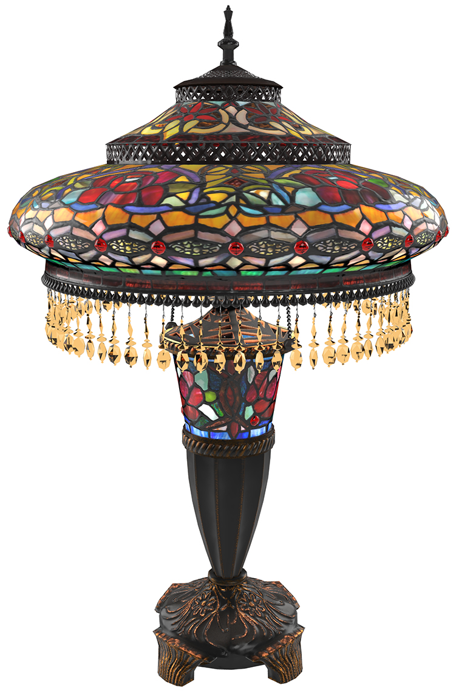
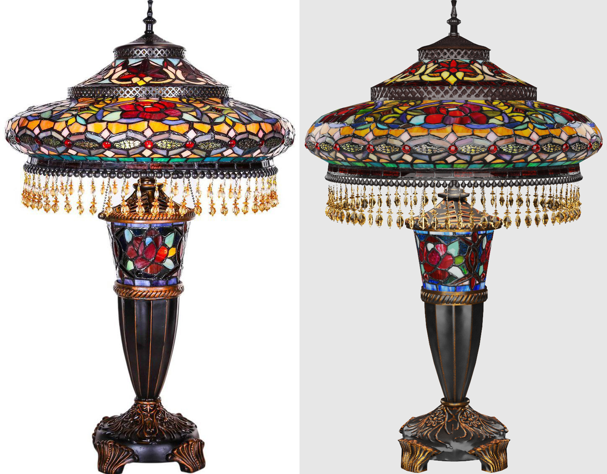
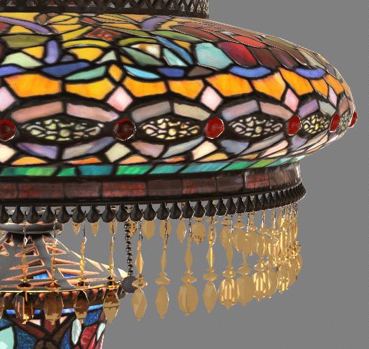
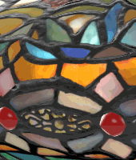
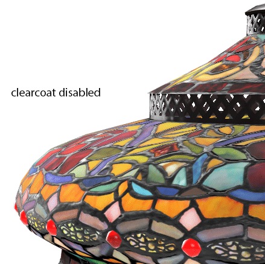
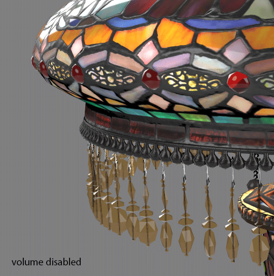
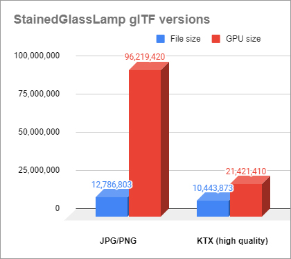
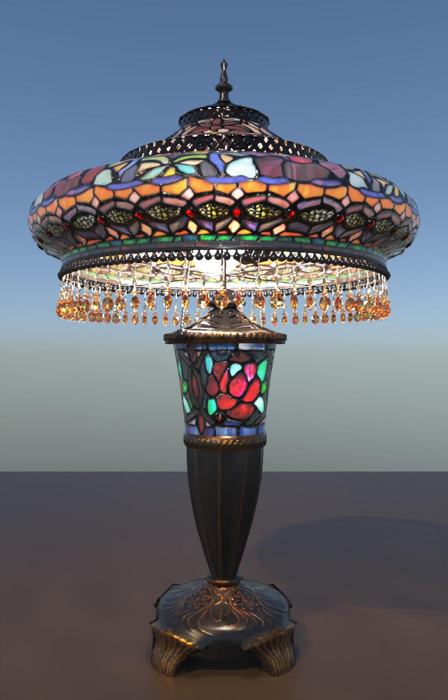
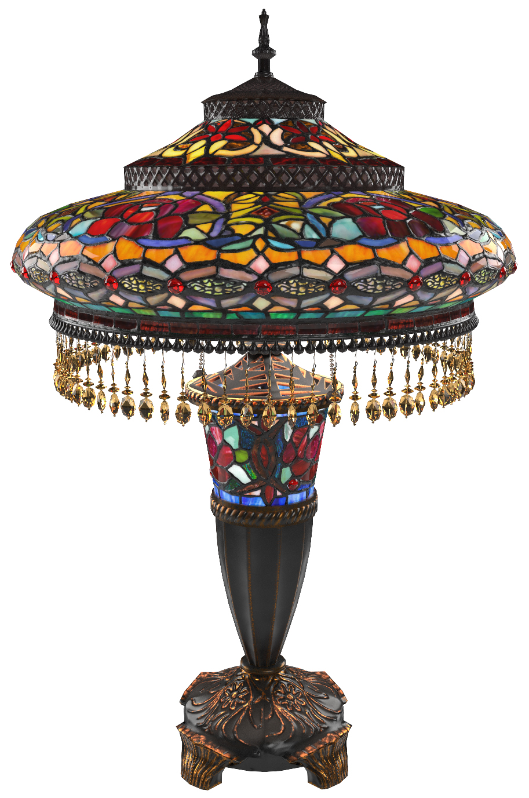

# StainedGlassLamp

## Screenshot



Above:  screenshot from [Babylon.js](https://sandbox.babylonjs.com/).

## Description

This model represents a real product, a Tiffany-style stained glass table lamp being sold on [the Wayfair website](https://www.wayfair.com/lighting/pdp/fleur-de-lis-living-credle-275-table-lamp-fdlv3095.html). 

The model is available in multiple variants:
1. `StainedGlassLamp-JPG-PNG-Simple.glb` uses no extensions for the widest compatibility. Base color textures with alpha were kept in PNG format, while the rest were converted into JPG.
1. `StainedGlassLamp-JPG-PNG-Transmission.glb` same as above, with the addition of [KHR_materials_clearcoat](https://github.com/KhronosGroup/glTF/blob/master/extensions/2.0/Khronos/KHR_materials_clearcoat/README.md), [KHR_materials_transmission](https://github.com/KhronosGroup/glTF/blob/master/extensions/2.0/Khronos/KHR_materials_transmission/README.md), and [KHR_materials_variants](https://github.com/KhronosGroup/glTF/blob/master/extensions/2.0/Khronos/KHR_materials_variants/README.md).
1. `StainedGlassLamp-JPG-PNG-Volume.glb` same as above, with the addition of [KHR_materials_ior](https://github.com/KhronosGroup/glTF/pull/1718) and [KHR_materials_volume](https://github.com/KhronosGroup/glTF/pull/1726).
1. `StainedGlassLamp-KTX-BasisU-Simple.glb` uses the same settings as `StainedGlassLamp-JPG-PNG-Simple.glb` except textures are compressed into KTX format using high-quality settings and the extension [KHR_texture_basisu](https://github.com/KhronosGroup/glTF/blob/master/extensions/2.0/Khronos/KHR_texture_basisu/).
1. `StainedGlassLamp-KTX-BasisU-Transmission.glb` uses the same settings as `StainedGlassLamp-JPG-PNG-Transmission.glb` except textures are in KTX format.
1. `StainedGlassLamp-KTX-BasisU-Volume.glb` uses the same settings as `StainedGlassLamp-JPG-PNG-Volume.glb` except textures are in KTX format.
1. `StainedGlassLamp-KTX-BasisU-Volume-ETC1S.glb` uses the same settings as `StainedGlassLamp-KTX-BasisU-Volume.glb` except KTX textures were compressed using only ETC1S.
1. `StainedGlassLamp-PNG-2048.glb` uses the same settings as `StainedGlassLamp-JPG-PNG-Volume.glb` except textures are all in PNG format, and are the highest resolution (mostly 2048).
1. `StainedGlassLamp-PNG-Pathtracer.glb` uses the same settings as `StainedGlassLamp-PNG-2048.glb` except all emissive textures have been disabled, and the emissiveFactor for the light bulbs has been set to (100,100,100).

## Reference Photos

The use of real-world photographic reference is meant to help glTF developers with calibrating material features and renderer behavior, to more accurately represent e-commerce products. Additional photo reference is available [on the Wayfair website](https://www.wayfair.com/lighting/pdp/fleur-de-lis-living-credle-275-table-lamp-fdlv3095.html).



Above: photo of the real product (left) next to a path-traced render in Dassault Systèmes [Enterprise PBR Sample Renderer](https://github.com/DassaultSystemes-Technology/dspbr-pt).

Below: additional reference photos of the real product.


## KHR_materials_variants

All the models except the -Simple versions use the extension [KHR_materials_variants](https://github.com/KhronosGroup/glTF/blob/master/extensions/2.0/Khronos/KHR_materials_variants/README.md) to add a variant with the emissive textures disabled to simulate the lights being turned off. 


Above: animated GIF of switching to the variant "lamp off" in [Babylon.js](https://sandbox.babylonjs.com/).

## KHR_materials_transmission

All the models except the -Simple versions use the extension [KHR_materials_transmission](https://github.com/KhronosGroup/glTF/blob/master/extensions/2.0/Khronos/KHR_materials_transmission/README.md) for the stained glass, the red embedded glass gems, and the amber hanging plastic beads to show colored translucency and specular reflection.



Above: animated GIF showing transmission enabled and disabled, in the [glTF Sample Viewer](https://github.khronos.org/glTF-Sample-Viewer-Release/).

The stained glass material uses roughness to simulate the microfacet scattering of light through a thin surface, effectively blurring light transmitted from behind it. Behind the glass you should be able to see blurry hints of opaque surfaces like the bright lamp bulbs and the dark hardware. This is especially evident with the "lamp off" variant and a bright background.



The stained glass material uses alpha-as-coverge in MASK mode to cut out holes where the red beads are present. This is meant to prevent the stained glass geometry from interfering with the transmission of the red beads. 

## KHR_materials_clearcoat

All the models except the -Simple versions use the extension [KHR_texture_clearcoat](https://github.com/KhronosGroup/glTF/blob/master/extensions/2.0/Khronos/KHR_materials_clearcoat/README.md) on the multicolored stained glass to add smooth reflections on top of the glass. The glass material must be rough for `KHR_materials_transmission` to create microsurface refractions, so clearcoat restores shiny surface reflections to the smooth outer surfaces of the stained glass.

The two textures for transmissionTexture and clearcoatTexture have been packed together into a single bitmap `StainedGlassLamp_glass_transmission-clearcoat` using the red and green channels to optimize memory use. 



Above: animated GIF showing clearcoat enabled and disabled, in [Babylon.js](https://sandbox.babylonjs.com/).

## KHR_materials_volume and KHR_materials_ior

The "Volume" models use the extensions [KHR_materials_volume]() and [KHR_materials_ior]() on the red embedded glass "gems" and the amber hanging plastic beads to produce an effect similar to the bending of light via refraction. The vertex normals on the amber beads have been split to create faceted refractions similar to the facets seen in cut and polished crystals or glass, whereas the red glass gems use smoothed normals for a rounded-glass effect. The amber beads are made of plastic so they use IOR 1.4, while the red gems are glass so they use IOR 1.52. The amber beads use volume thicknessFactor 0.02, while the red glass gems use thicknessFactor 0.03.



Above: animated GIF showing volume enabled and disabled, in [Babylon.js](https://sandbox.babylonjs.com/).

## KHR_textures_basisu

The "KTX" models use [Basis Universal](https://github.com/KhronosGroup/KTX-Software) texture compression and the extension [KHR_texture_basisu](https://github.com/KhronosGroup/glTF/blob/master/extensions/2.0/Khronos/KHR_texture_basisu/). 

For most of the KTX models, the aim was to achieve the same visual quality as the original JPG/PNG textures, while compressing both file size and GPU memory size. An exception is `StainedGlassLamp-KTX-BasisU-Volume-ETC1S.glb` which only uses ETC1S for the smallest possible file size, while sacrificing some visual quality.

The other models' textures were compressed from PNG source into KTX2 using [toktx](https://github.com/KhronosGroup/KTX-Software) via a combination of compression settings that favored high quality. UASTC was used for ORM and Normal textures and ETCS1 for Base Color and Emissive textures, however exceptions were made based on analyzing results... the `glass_basecolor-alpha` and `glass_emissive` textures were changed from ETC1S to UASTC since these were prominently displayed on the model and contained a lot of color variation. 

toktx compression settings:
```
set mipmap=--genmipmap
set uastc=--uastc 4 --uastc_rdo_l .5 --uastc_rdo_d 65536 --zcmp 22
set uastchq=--uastc 4 --uastc_rdo_l .25 --uastc_rdo_d 65536 --zcmp 22
set etcs1=--bcmp --clevel 4 --qlevel 255
toktx %mipmap% %etcs1% StainedGlassLamp_base_basecolor.ktx2 StainedGlassLamp_base_basecolor.png
toktx %mipmap% %etcs1% StainedGlassLamp_base_emissive.ktx2 StainedGlassLamp_base_emissive.png
toktx %mipmap% %uastc% StainedGlassLamp_glass_basecolor-alpha.ktx2 StainedGlassLamp_glass_basecolor-alpha.png
toktx %mipmap% %uastc% StainedGlassLamp_glass_emissive.ktx2 StainedGlassLamp_glass_emissive.png
toktx %mipmap% %etcs1% StainedGlassLamp_grill_basecolor-alpha.ktx2 StainedGlassLamp_grill_basecolor-alpha.png
toktx %mipmap% %etcs1% StainedGlassLamp_grill_emissive.ktx2 StainedGlassLamp_grill_emissive.png
toktx %mipmap% %etcs1% StainedGlassLamp_hardware_basecolor.ktx2 StainedGlassLamp_hardware_basecolor.png
toktx %mipmap% %etcs1% StainedGlassLamp_hardware_emissive.ktx2 StainedGlassLamp_hardware_emissive.png
toktx %mipmap% %uastchq% --assign_oetf linear --assign_primaries none StainedGlassLamp_base_normal.ktx2 StainedGlassLamp_base_normal.png
toktx %mipmap% %uastchq% --assign_oetf linear --assign_primaries none StainedGlassLamp_base_occlusion-rough-metal.ktx2 StainedGlassLamp_base_occlusion-rough-metal.png
toktx %mipmap% %uastc% --assign_oetf linear --assign_primaries none StainedGlassLamp_bulbs_occlusion-rough-metal.ktx2 StainedGlassLamp_bulbs_occlusion-rough-metal.png
toktx %mipmap% %uastchq% --assign_oetf linear --assign_primaries none StainedGlassLamp_glass_normal.ktx2 StainedGlassLamp_glass_normal.png
toktx %mipmap% %uastc% --assign_oetf linear --assign_primaries none StainedGlassLamp_glass_occlusion-rough-metal_transmission.ktx2 StainedGlassLamp_glass_occlusion-rough-metal_transmission.png
toktx %mipmap% %uastc% --assign_oetf linear --assign_primaries none StainedGlassLamp_glass_transmission-clearcoat.ktx2 StainedGlassLamp_glass_transmission-clearcoat.png
toktx %mipmap% %uastchq% --assign_oetf linear --assign_primaries none StainedGlassLamp_grill_normal.ktx2 StainedGlassLamp_grill_normal.png
toktx %mipmap% %uastc% --assign_oetf linear --assign_primaries none StainedGlassLamp_grill_occlusion-rough-metal.ktx2 StainedGlassLamp_grill_occlusion-rough-metal.png
toktx %mipmap% %uastchq% --assign_oetf linear --assign_primaries none StainedGlassLamp_hardware_normal.ktx2 StainedGlassLamp_hardware_normal.png
toktx %mipmap% %uastc% --assign_oetf linear --assign_primaries none StainedGlassLamp_hardware_occlusion-rough-metal.ktx2 StainedGlassLamp_hardware_occlusion-rough-metal.png
toktx %mipmap% %uastc% --assign_oetf linear --assign_primaries none StainedGlassLamp_steel_occlusion-rough-metal.ktx2 StainedGlassLamp_steel_occlusion-rough-metal.png
```


Above: screenshots from [Babylon.js](https://sandbox.babylonjs.com/): JPG and PNG textures (left), KTX textures (right), with size information from [glTF-Transform](https://github.com/donmccurdy/glTF-Transform). Below: chart comparing the sizes.



## Pathtraced Examples ##

The model `StainedGlassLamp-PNG-Pathtracer.glb` is setup for use in non-rasterized renderers, which often require a few adjustments. E.g. emissive textures that simulate light bounce have been removed, allowing the path tracing to create more accurate bounce lighting. The emissiveFactor for the light bulbs has been increased to 100 to cast enough internal lighting into the model.



Above: ray-traced render in Intel [OSPRay Studio](https://github.com/ospray/ospray_studio).

Below: path-traced render in Dassault Systèmes [Enterprise PBR Sample Renderer](https://github.com/DassaultSystemes-Technology/dspbr-pt).



## Authoring Details ##

The model was created with [3ds Max](https://www.autodesk.com/products/3ds-max/) and exported to glTF via the [Max2Babylon](https://github.com/BabylonJS/Exporters/tree/master/3ds%20Max) exporter. The glTF file was then edited manually in [Visual Studio Code](https://code.visualstudio.com) with the [glTF Tools](https://github.com/AnalyticalGraphicsInc/gltf-vscode) extension to add KHR extensions. [KTX Software](https://gltf-transform.donmccurdy.com/cli.html) was used to compress textures into KTX2 format. 

The textures were created from photo reference, augmented with procedural textures and hand-painted detail. The emissive textures were pre-rendered in 3ds Max using the V-Ray renderer and sphere lights, and the textures were hand-tuned to work with baseColor and transmission.

## License Information

(C) 2021, Wayfair LLC. CC-BY 4.0 International https://creativecommons.org/licenses/by/4.0/. 
