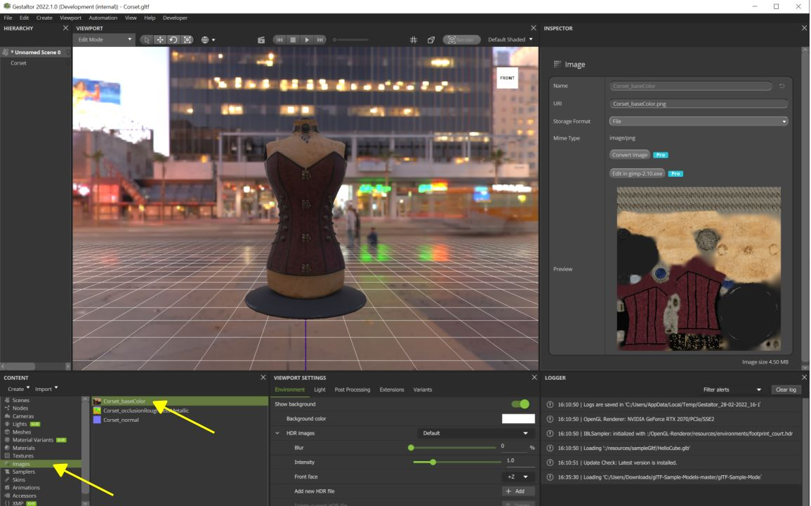
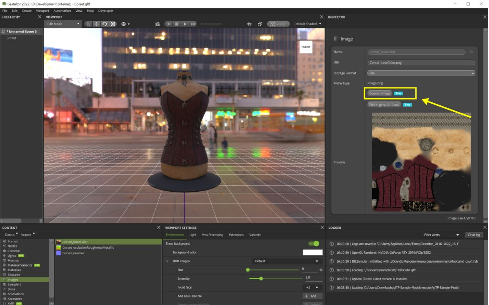
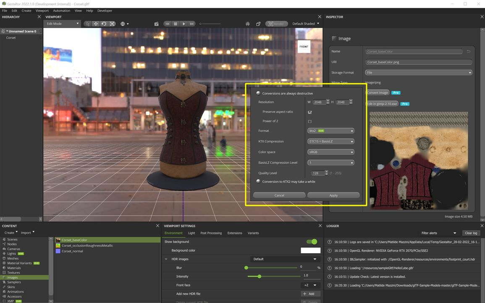

上一章: [KTX Guide for toktx](KTXArtistGuide_toktx.cn.md) | 主页: [KTX Artist Guide](../KTXArtistGuide.cn.md) | 下一章: [KTX Guide for glTF-Compressor](KTXArtistGuide_glTF-Compressor.cn.md)

---

## Gestaltor 的 KTX指南

[Gestaltor](https://gestaltor.io/) 是一款支持 KTX 的可视化 glTF 编辑器。可用于编辑单个 glTF 文件，或通过命令行进行批处理。对 2MB 以下的 glTF 文件的非商业用途免费。订阅可取消所有限制，并可访问命令行。

1. 通过 Steam、Linux、MacOS 或 Windows 安装应用程序。请参见 [安装说明](https://gestaltor.help/started/installation.html). 

2. 通过菜单栏中的 _File > Open…_ 打开 glTF，例如 [Corset](https://github.com/KhronosGroup/glTF-Sample-Assets/tree/main/Models/Corset#corset).

3. 在 _Content_ 部分, 打开 Images 选项并选择其中一种纹理：

4. 在 _Inspector_ 部分, 点击 _Convert image_：

5. 选择 _ktx2_ 作为格式。 选择压缩方式，然后按 _Apply_。

6. 编辑器没有进度条显示；处理的时间取决于图像和设置。

7. 通过菜单栏中的 _File > Save_ 保存处理完的资产。

> 📝 注意: 
> 除了 KTX 压缩之外，Gestaltor 还提供许多其他工具：调整 glTF 资产、编辑材质、添加扩展等。

---

上一章: [KTX Guide for toktx](KTXArtistGuide_toktx.cn.md) | 主页: [KTX Artist Guide](../KTXArtistGuide.cn.md) | 下一章: [KTX Guide for glTF-Compressor](KTXArtistGuide_glTF-Compressor.cn.md)
