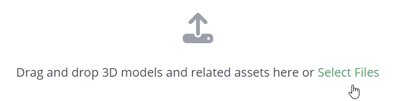
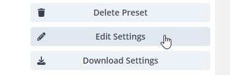
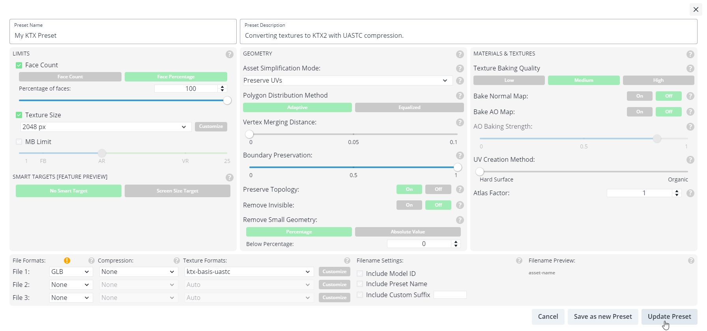
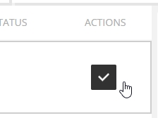
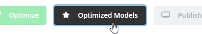
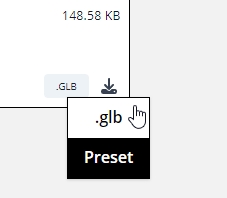

上一章: [KTX Guide for glTF-Transform](KTXArtistGuide_glTF-Transform.cn.md) | 主页: [KTX Artist Guide](../KTXArtistGuide.cn.md) | 下一章: [KTX Guide for toktx](KTXArtistGuide_toktx.cn.md)

---

## RapidCompact 的 KTX指南

[RapidCompact](https://rapidcompact.com/) 是一个用于优化3D数据（支持KTX）的在线平台。免费用于非商业用途。可用于优化单个 glTF 文件或批量处理文件。

1. 注册以创建账户，或登录到现有账户。

    

2. 传模型。例如，鸭子模型 https://github.com/KhronosGroup/glTF-Sample-Assets/blob/main/Models/Duck/glTF-Binary/Duck.glb

    

3. 进入 _Optimize_ t选项卡调整转换设置。

    

4. 在 _Optimization Settings_ 部分下选择 _Custom_，点击空的 + 按钮创建一个新的预设，然后点击 _Edit Settings_。

    

5. 由于我们只是将纹理转换为 KTX，而不是简化模型，因此我们将调整一些设置：

    * Percentage of Faces: 100
    * Texture Size: 512 px (your number here will vary, depending on your input file) 
    * File 1 Texture Formats: ktx-basis-uastc
    * File 2: None
    * File 3: None
    * Asset Simplificaiton Mode: Preserve UVs
    * Polygon Distribution Method: Adaptive
    * Vertex Merging Distance: 0
    * Boundary Preservation: 1
    * Preserve Topology: On
    * Remove Invisible: Off
    * Remove Small Geometry: Percentage
    * Below Percentage: 0
    * Bake Normal Map: Off

    

    > 📝 注意: 
    > RapidCompact 提供 KTX 压缩之外的许多附加功能：几何图形处理、纹理烘焙、UV 重映射和着色器优化。

6. 按 _Update Preset_ 按钮保存设置。

    

7. 确保 _Actions_ 栏中至少有一个模型已启用。

    

8. 按下 _OPTIMIZE SELECTED MODELS_ 按钮。

    

9. 完成后，进入 _Optimized Models_ 选项卡下载转换后的模型，并从下载下拉菜单中选择 _.glb_ 。

    

    

    预设优化设置也可以下载，以便存档或与他人共享。

---

上一章: [KTX Guide for glTF-Transform](KTXArtistGuide_glTF-Transform.cn.md) | 主页: [KTX Artist Guide](../KTXArtistGuide.cn.md) | 下一章: [KTX Guide for toktx](KTXArtistGuide_toktx.cn.md)