上一章: [KTX Guide for Gestaltor](KTXArtistGuide_Gestaltor.cn.md) | 主页: [KTX Artist Guide](..\KTXArtistGuide.cn.md) | 下一章: [KTX Guide for glTF-Transform](KTXArtistGuide_glTF-Transform.cn.md)

---

## glTF-Compressor 的 KTX指南

[glTF-Compressor](https://github.khronos.org/glTF-Compressor-Release/) 是一款基于网络的 3D 查看器，带有用于压缩 glTF 纹理的工具。有关该工具的更多详情，请参阅 Khronos Group 发布的 [glTF-Compressor 最新进展](https://www.khronos.org/blog/optimize-3d-assets-with-khronos-new-gltf-compressor-tool) 。

1. 打开浏览器，进入 [glTF-Compressor](https://github.khronos.org/glTF-Compressor-Release/).

1. 拖入一个 glTF 资产（或使用现有的示例资产之一）。这可以是一个 .GLB 文件，也可以是一个 .glTF 文件加上纹理和 .BIN 文件。

1. 打开 _Texture Compressor_ 选项卡：

    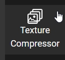

4. 默认情况下，所有纹理都被选中。要选择特定纹理，请在 _Select by Type_ 中选择 _None_ 选项，然后启用单个纹理：

    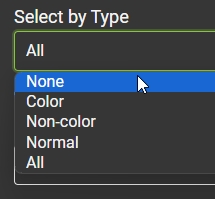 

    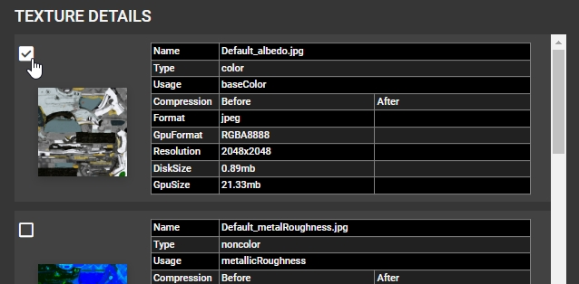

5. 可以通过选择其他选项来多选纹理。_Color_ 选项将选择所有颜色纹理，如 `baseColorTexture`, `emissiveTexture`, `specularColorTexture`等。

6. 将 _Image Type_ 设置为 _KTX2_:

    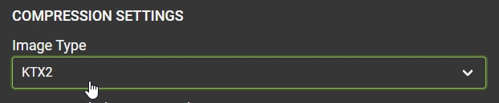 

7. 将 _Image Encoding_ 设置为 _UASTC_。大多数纹理使用 _UASTC_ 时效果最佳（详情请参见 [KTX 艺术家指南](..\KTXArtistGuide.cn.md) 主页面）：

    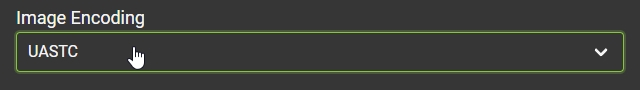 

8. 为获得最高质量，请将 _Level_ 设置为 _Slowest_ 并启用 _Supercompression_。这将在下面显示更多高级设置，但这些设置可以保留为默认值，除非你想进行调整。

    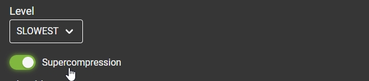 

9. 按下 _Compress Textures_ 开始编码过程。请注意！KTX 编码可能会非常慢，因为它对电脑硬件的要求很高。该按钮将显示当前正在处理的纹理。

    

    > [!重要事项]
    > 如果浏览器警告说未响应，请让它继续等待。使用 Slowest 设置压缩 2k 纹理可能需要数分钟才能完成处理。

10. 压缩完成后，3D 视图将显示之前/之后的滑块，可用于检查差异：

    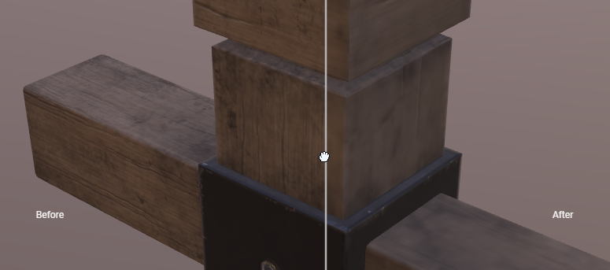 

11. 每个压缩纹理旁边都有一个 _Compare_ 按钮，可将 3D 视图切换为 2D 视图（或使用空格键切换）。在 2D 视图中拖动鼠标右键可缩放，拖动鼠标中键可平移。

    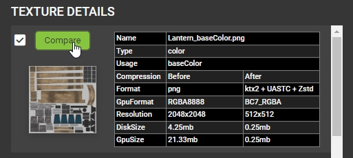 

    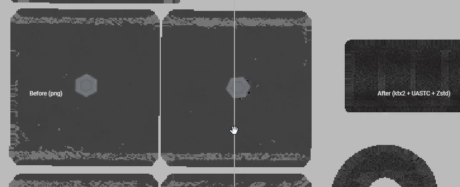 

12. 在 3D 视图中， Advanced Settings 选项卡允许在三维模型上显示单个纹理通道。在本例中，压缩后的 "粗糙度 "纹理正在模型上单独显示：

    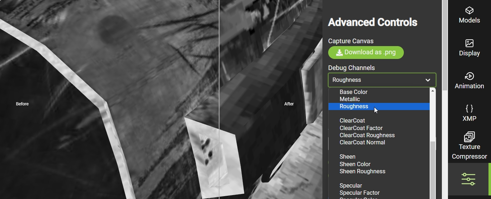 

13. 回到 _Texture Compressor_ 选项卡，可以使用 _Export as .gltf_ 按钮导出完成的文件。还可以导出 KTX 压缩设置，与 [toktx](KTXArtistGuide_toktx.md) 等命令行工具配合使用，以相同的压缩设置批量处理多个 glTF 资产。

    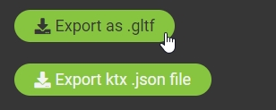

---

上一章: [KTX Guide for Gestaltor](KTXArtistGuide_Gestaltor.cn.md) | 主页: [KTX Artist Guide](..\KTXArtistGuide.cn.md) | 下一章: [KTX Guide for glTF-Transform](KTXArtistGuide_glTF-Transform.cn.md)