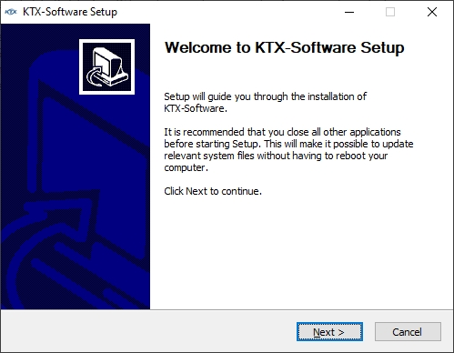
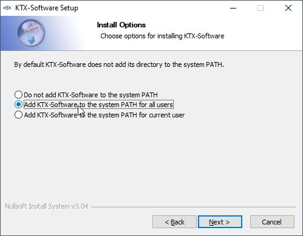
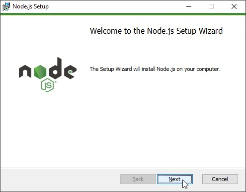
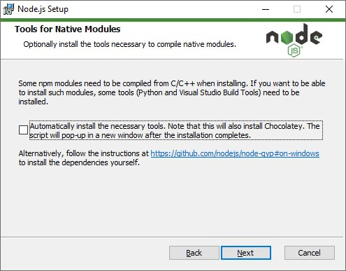
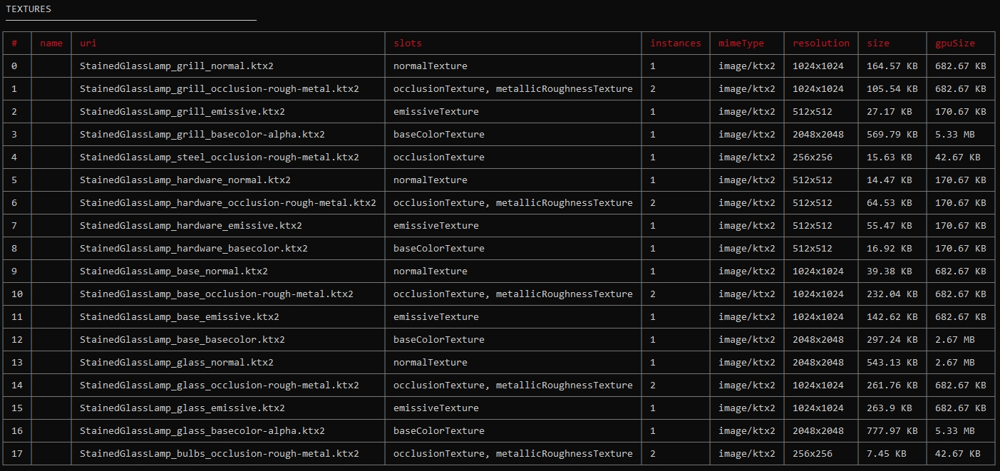

上一章: [KTX Guide for glTF-Compressor](KTXArtistGuide_glTF-Compressor.cn.md) | 主页: [KTX Artist Guide](../KTXArtistGuide.cn.md) | 下一章: [KTX Guide for RapidCompact](KTXArtistGuide_RapidCompact.cn.md)

---

## glTF-Transform 的 KTX指南

[glTF-Transform](https://gltf-transform.donmccurdy.com/cli.html) 是用于编辑 glTF 的命令行工具。

### 安装 KTX 软件

1. 访问 [KTX-Software releases](https://github.com/KhronosGroup/KTX-Software/releases).

1. 找到您想要的版本（通常是最新版本）。在 release 底部，找到 Assets 部分，点击三角形展开。

1. 下载适用于你的操作系统的版本并安装。

1. 例如，Windows 安装程序如下所示：



5. 在系统的path环境变量中添加 KTX-Software，这不是必须的，但会使运行命令行工具更加容易。



### 安装 Node.js

Node.js 包含 NPM 包管理器，通过它可以运行 javascript 工具 [glTF-Transform](https://gltf-transform.donmccurdy.com/cli.html)，来使用 KTX 纹理压缩技术压缩在 glTF 中的纹理。

1. 访问 https://nodejs.org/en/

1. 为您的操作系统下载并安装。

1. 例如，Windows 安装程序如下所示：



4. 禁用此处的复选框，即可跳过 “Tools for Native Modules” 步骤：



### 安装 glTF-Transform

[glTF-Transform](https://gltf-transform.donmccurdy.com/cli.html) 可用于压缩 glTF 模型中的大部分纹理。

1. 打开操作系统的 CMD 工具（或 Windows 中的 PowerShell）。

1. 安装 glTF-Transform:

``` 
npm install --location=global @gltf-transform/cli
```

### 使用 glTF-Transform 压缩到 KTX

一切安装完毕后，您就可以压缩 glTF 文件了。有不同的压缩选项可供选择；下面是几种方法供您参考。

### 方法 1: UASTC + ETC1S

使用 UASTC 压缩法线和遮挡/粗糙度/金属感 (ORM) 纹理，使用 ETC1S 压缩所有其他纹理：
```
gltf-transform uastc input.glb output1.glb --level 4 --rdo 4 --slots "{normalTexture,occlusionTexture,metallicRoughnessTexture}" --zstd 18 --verbose

gltf-transform etc1s output1.glb output2.glb --quality 255 --verbose
```

* `gltf-transform` 是工具本身。
* `uastc` 是压缩方法。它的压缩率低于 etc1s，但产生的块状假象也较少。对于 RGB 值不相关的纹理（如 ORM 贴图），它比 ETC1S 产生的假象更少。
* `input.glb` 是要压缩的文件，其中包含 PNG 和/或 JPEG 纹理。将其重命名为与要压缩的文件相匹配的名称。
* `output1.glb` 是要保存的临时文件，其中包含新的 KTX 纹理。上述代码块中的第一步将仅使用 UASTC 压缩法线凹凸和闭塞-粗糙-金属纹理，其他纹理保持原始格式。第二步将使用 ETC1S 压缩其余纹理。
* `--level 4` 是一种高质量设置。它能产生可实现的最高质量，但速度会非常慢。如果速度太慢，请尝试 3 级。
* `--rdo 4` 是中等质量设置，但生成的文件较小。全范围为 [.001, 10.0]。较低的值会产生较高的质量/较大的 LZ 压缩文件，较高的值会产生较低的质量/较小的 LZ 压缩文件。可以尝试的范围是 [.25, 10]。对于法线贴图，尝试的范围是[.25, .75]。
* `--slots` 可以包含或排除纹理类型：
* `"{normalTexture,occlusionTexture,metallicRoughnessTexture}"` 让 glTF Transform 仅使用 UASTC 压缩法线和 ORM 纹理。要查看 GLB 中的纹理插槽列表，请使用命令 `gltf-transform inspect input.glb` ，这将显示每个纹理的尺寸和文件大小。这对确定 `--slots` 的名称特别有用，以便对不同的纹理类型应用不同的压缩设置。
* `--zstd 18` 应用超级压缩。压缩级别范围为 [1，22]，默认为 18，0 表示未压缩。数值越小速度越快，但压缩效果越差。超过 20 的值需要更多内存，应谨慎使用。
* `--verbose` 逐步显示 glTF Transform 正在进行的操作。在 Windows 上，压缩过程中没有进度指示器，只有闪烁的光标。 `--verbose` 可以作为进度条，确保它正在工作，并帮助你找出是否包含了正确的选项。
* `output1.glb` 是上述代码块第一步的输出结果，现在用于第二步，使用 ETC1S 压缩其余纹理。
* 第二步中的 `output2.glb` 是最终完全压缩的模型，所有纹理都是 KTX 格式。将其重命名为所需的输出名称。
* 第二步中的 `--quality 255` 会让 glTF-Transform 使用 ETC1S 的最高质量，但压缩率较低，压缩文件的时间也较长。当质量比转换速度更重要时，请使用此选项。

> 📝 注意: 
>  这是两个独立的命令。第一条命令使用 UASTC 仅压缩普通和 ORM 地图。第二条命令使用 ETC1S 压缩所有剩余纹理。第 1 条命令完成后再执行第 2 条命令。由于 glTF-Transform 不会重新压缩现有的 KTX 文件，因此第 2 条命令不需要使用 `--slots "!{normalTexture,occlusionTexture,metallicRoughnessTexture}"` 参数来省略法线/ORM 贴图。它只会压缩非 KTX 纹理。

### 方法 2: UASTC

使用 UASTC 压缩所有纹理：
```
gltf-transform uastc input.glb output.glb --level 4 --rdo 4 --zstd 18 --verbose
```
* 这会产生较大的文件，但通常显示较少的压缩痕迹。

### 方法 3: ETC1S

使用 ETC1S 压缩所有纹理：

```
gltf-transform etc1s input.glb output.glb --verbose
```
* T这样生成的文件最小，但通常会产生大量块状伪影。
* 当文件大小和内存大小比最高视觉质量更重要时，请使用此方法。
* 如果纹理主要使用同色系，也可以使用此方法。请看下面的 Duck 示例。

### 更多方法

尝试不同的压缩设置和组合；根据您对尺寸和质量的总体目标进行调整。对特定纹理插槽进行隔离设置。纹理对不同压缩设置的反应各不相同，因此稍加尝试就能获得更好的效果。

要了解可用设置的更多信息，请在命令行中输入以下任一命令：
* `gltf-transform help etc1s`
* `gltf-transform help uastc`

### 评估输出

在您选择的查看器中仔细检查压缩文件。
* 仔细观察，在不同的纹理类型上可能会出现不理想的压缩伪影：basecolor, alpha, normal maps, roughness, metalness, occlusion, emissive 等。
* [glTF Sample Viewer](https://github.khronos.org/glTF-Sample-Viewer-Release/) 是一个不错的渲染器。您可以使用 [glTF Project Explorer](http://github.khronos.org/glTF-Project-Explorer/) 查找 glTF 查看器列表。

使用 `INSPECT` 命令检查每个纹理的文件大小以及它们在 GPU 内存中的大小。
```
gltf-transform inspect input.glb --format md
```
`INSPECT` 命令的输出示例：


MD 格式更易于直接阅读，可以直接粘贴到 Markdown 文档中。CSV 格式非常适合加载到电子表格中进行进一步的数据处理和分析。

---

上一章: [KTX Guide for glTF-Compressor](KTXArtistGuide_glTF-Compressor.cn.md) | 主页: [KTX Artist Guide](../KTXArtistGuide.cn.md) | 下一章: [KTX Guide for RapidCompact](KTXArtistGuide_RapidCompact.cn.md)