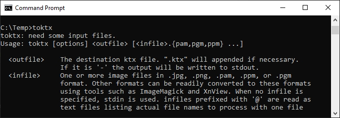

上一章: [KTX Guide for RapidCompact](KTXArtistGuide_RapidCompact.cn.md) | 主页: [KTX Artist Guide](..\KTXArtistGuide.cn.md) | 下一章: [KTX Guide for Gestaltor](KTXArtistGuide_Gestaltor.cn.md)

---

## toktx 的 KTX 指南

[toktx](https://github.com/KhronosGroup/KTX-Software#readme) 是一款将纹理压缩为 KTX 格式的命令行工具。对于艺术家来说，命令行最初可能会让人望而生畏，但它提供了最大的灵活性和对所有压缩选项的控制。

### 压缩单个纹理

命令行工具 `toktx` 可用于将单个图像文件转换为采用 Basis Universal 压缩技术的 KTX，它是 [Khronos 纹理工具](https://github.com/KhronosGroup/KTX-Software#readme) 中的一个。

转换纹理后，需要在 glTF 文件中引用新的 KTX 文件，方法是替换现有纹理或将其添加为新纹理。

### 从 GLB 中提取纹理

要使用 toktx 压缩，需要从 GLB 中解压缩单独的纹理。

您可以使用 [glTF-Pipeline](https://github.com/CesiumGS/gltf-pipeline) 将单个 GLB 转换为包含外部二进制文件（BIN 和纹理）的 glTF。

1. 打开操作系统命令提示符（或 Windows 中的 PowerShell）。

1. 如果您之前在 [glTF-Transform](KTXArtistGuide_glTF-Transform.cn.md) 教程中安装了 Node.js, 现在可以轻松安装 glTF Pipeline：
 `npm install -g gltf-pipeline`
3. 将 GLB 转换为 glTF：
 `gltf-pipeline -i input.glb -j`
4. 将资产重新打包回 GLB：
 `gltf-pipeline -i input.glb -b`

解压缩和打包是无损转换。glTF 资产（JSON、.bin 和图像）只需从单个二进制 GLB 文件解包即可。请注意，GLB 文件并不一定比独立的 glTF/bin/image 文件的总和小，因为当中每个文件都已经过压缩。

您还可以使用 glTF-Pipeline 应用 [Draco 网格压缩](https://github.com/google/draco)，但这通常是有损操作，因此应在 KTX 转换后的最后一步进行。

### 使用 ETC1S / BasisLZ 压缩
当压缩到 ETC1S / BasisLZ 时，`toktx` 有三个主要参数需要调整，另外还有输入和输出：

下面是一个完整的 `toktx` 命令行示例：

    toktx --encode etc1s --clevel 1 --qlevel 128 mytexture.ktx mytexture.png

1. `toktx` 激活工具。

1. `--encode etc1s` 告诉工具使用 ETC1S / BasisLZ 压缩。

1. `--clevel <level>` 控制压缩级别。使用 0 至 5 范围内的整数值（没有小数位的单个数字）。默认值为 1。数值越大，速度越慢，但质量越高。

1. `--qlevel <level>` 控制质量级别。使用 1 至 255 范围内的整数值。默认值为 128。数值越小，压缩效果越好，但质量越低，完成速度越快。数值越大，压缩效果越差，但质量越高，完成速度越慢。

1. `mytexture.ktx` 是要保存的输出文件的名称。这是您希望最终得到的文件名。将 `mytexture` 替换为您的纹理名称。请确保保留 `.ktx` 扩展名。

1. `mytexture.png` 是要处理的输入文件的名称。这是您开始使用的文件名。将 `mytexture` 替换为输入纹理的名称。如果输入文件是 jpg，则将 `png` 改为 `jpg`。

### 使用 UASTC / Supercompression 压缩
命令行工具 `toktx` 提供了四个 UASTC 编解码器参数：
* **质量级别** (`--uastc_quality <level>`): [0, 4] 范围内的整数，默认值为 2。 0 - 最快/最低质量， 3 - 较慢但是实用的选项， 4 - 特别特别慢但可实现的最高质量。
* **RDO 质量标量** (`--uastc_rdo_l [<lambda>]`): 启用 UASTC RDO 后处理，并可选择设置 UASTC RDO 质量标量 (lambda)。数值越小，LZ 压缩文件的质量越高/越大；数值越大，LZ 压缩文件的质量越低/越小。可以尝试的范围是[.25,10]。法线贴图的理想范围是[.25,.75]。完整范围为 [.001,10.0]，默认值为 1.0。
* **RDO 字典字节长度** (`--uastc_rdo_d [<size>]`): [256, 65536] 范围内的整数值，默认为 32768。数值越小，压缩速度越快，但效率越低。
* **Zstandard 压缩级别** (`--zcmp [<level>]`): 在 UASTC 压缩后应用 Zstandard 无损超级压缩。数值范围为 [1, 22]，默认值为 3。值越小压缩得越快，但是压出来的体积大。超过 20 的值在压缩过程中需要更多内存，应谨慎使用。

---

上一章: [KTX Guide for RapidCompact](KTXArtistGuide_RapidCompact.cn.md) | 主页: [KTX Artist Guide](..\KTXArtistGuide.cn.md) | 下一章: [KTX Guide for Gestaltor](KTXArtistGuide_Gestaltor.cn.md)