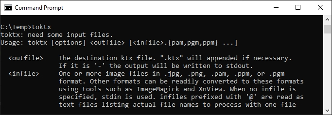

Previous: [KTX Guide for RapidCompact](KTXArtistGuide_RapidCompact.md) | Home: [KTX Artist Guide](..\KTXArtistGuide.md) | Next: [KTX Guide for Gestaltor](KTXArtistGuide_Gestaltor.md)

---

## KTX Guide for toktx

[toktx](https://github.com/KhronosGroup/KTX-Software#readme) is a command-line tool for compressing textures into KTX format. The command line may initially be daunting for artists, but it offers the most flexibility and control over all compression options. 

### Compressing Individual Textures

The command line tool `toktx` can be used to convert individual image files to KTX with Basis Universal compression, one of the [Khronos Texture Tools](https://github.com/KhronosGroup/KTX-Software#readme).

After converting a texture, the new KTX files will need to be referenced by your glTF file, by either replacing existing textures or adding them as new ones.

### Extracting Textures from a GLB

To compress with toktx, the individual textures need to be unpacked from a GLB. 

You can use [glTF-Pipeline](https://github.com/CesiumGS/gltf-pipeline) to convert from a single GLB into a glTF with external binaries (BIN and textures).

1. Open the OS command prompt (or PowerShell in Windows).

1. If you installed Node.js earlier with [glTF-Transform](KTXArtistGuide_glTF-Transform.md), you can now easily install glTF Pipeline:
 `npm install -g gltf-pipeline`
3. To convert a GLB into a glTF:
 `gltf-pipeline -i input.glb -j`
4. To re-pack assets back into a GLB:
 `gltf-pipeline -i input.glb -b`

Unpacking and packing are lossless conversions. The glTF assets (JSON, .bin, and images) are simply unpacked from a single binary GLB file. Note that the GLB is not necessarily a smaller file than the sum of the separate glTF/bin/image files, because the separate files are already compressed.

You may additionally use glTF-Pipeline to apply [Draco mesh compression](https://github.com/google/draco), however this is generally a lossy operation, so it should be done as a final step after KTX conversion.

### Compressing with ETC1S / BasisLZ
When compressing to ETC1S / BasisLZ `toktx` has three main parameters to adjust, plus the input and output:

Here's an example of a full `toktx` command line: 

    toktx --encode etc1s --clevel 1 --qlevel 128 mytexture.ktx mytexture.png

1. `toktx` activates the tool.

1. `--encode etc1s` tells the tool to use ETC1S / BasisLZ compression.

1. `--clevel <level>` controls the compression level. Use an integer value (a single number with no decimal places) within the 0 to 5 range. The default is 1. Higher values are slower, but give higher quality.

1. `--qlevel <level>` controls the quality level. Use an integer value within the 1 to 255 range. The default is 128. A lower number gives better compression, but lower quality, and will finish faster. A higher number gives less compression, but is higher quality, and finishes more slowly.

1. `mytexture.ktx` is the name of the output file to be saved. This is the filename you wish to end up with. Replace `mytexture` with the name of your texture. Be sure to keep the `.ktx` extension.

1. `mytexture.png` is the name of the input file to be processed. This is the filename you are starting out with. Replace `mytexture` with the name of your input texture. If your input is a jpg then change `png` to `jpg`. 

### Compressing with UASTC / Supercompression
The `toktx` command line tool exposes four UASTC codec parameters:
* **Quality Level** (`--uastc_quality <level>`): Integer value of [0, 4] range, default is 2. 0 - fastest/lowest quality, 3 - slowest practical option, 4 - impractically slow / highest achievable quality.
* **RDO Quality Scalar** (`--uastc_rdo_l [<lambda>]`): Enable UASTC RDO post-processing and optionally set UASTC RDO quality scalar (lambda). Lower values yield higher quality/larger LZ compressed files, higher values yield lower quality/smaller LZ compressed files. A good range to try is [.25,10]. For normal maps a good range is [.25,.75]. The full range is [.001,10.0]. Default is 1.0.
* **RDO Dictionary Byte Length** (`--uastc_rdo_d [<size>]`): Integer value of [256, 65536] range, default is 32768. Lower values lead to faster but less efficient compression.
* **Zstandard Compression Level** (`--zcmp [<level>]`): Apply Zstandard lossless supercompression after UASTC compression. The range is [1, 22], the default is 3. Lower values lead to faster processing but give less compression. Values above 20 should be used with caution as they require more memory during compression.

---

Previous: [KTX Guide for RapidCompact](KTXArtistGuide_RapidCompact.md) | Home: [KTX Artist Guide](..\KTXArtistGuide.md) | Next: [KTX Guide for Gestaltor](KTXArtistGuide_Gestaltor.md)